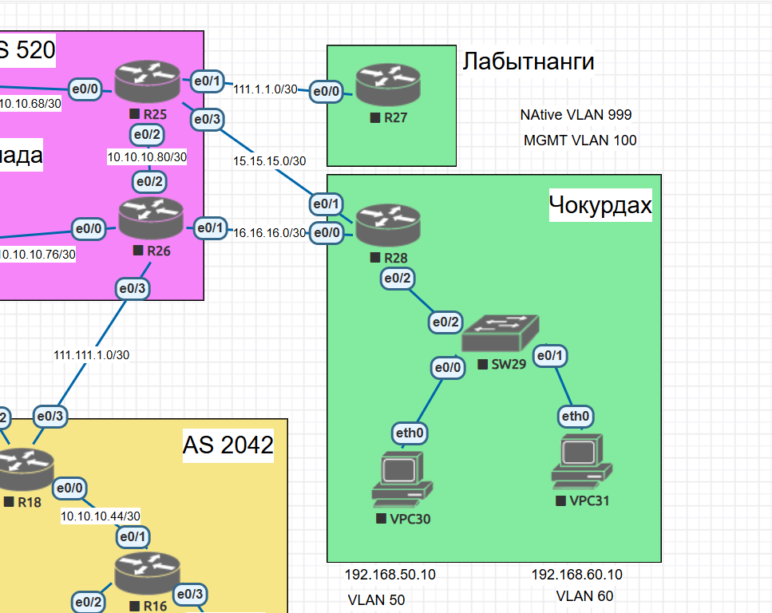

# PBR

## Цель:
Настроить политику маршрутизации в офисе Чокурдах;  
Распределить трафик между 2 линками.


- Настроите политику маршрутизации для сетей офиса.
- Распределите трафик между двумя линками с провайдером.
- Настроите отслеживание линка через технологию IP SLA.(только для IPv4)
- Настройте для офиса Лабытнанги маршрут по-умолчанию.
- План работы и изменения зафиксированы в документации .


## Топология



### Интерфейсы и адресация

| DeviceName | Int  | IP               | Description |
| ---------- | ---- | ---------------- | ----------- |
| R25        | e0/0 | 10.10.10.70/30   | R23         |
|            | e0/1 | 111.1.1.1/30     | R27 Laby    |
|            | e0/2 | 10.10.10.81/30   | R26         |
|            | e0/3 | 15.15.15.1/30    | R28 Cho     |
|            | lo0  | 1.1.1.25         |             |
| R26        | e0/0 | 10.10.10.78/30   | R24         |
|            | e0/1 | 16.16.16.1/30    | R28 Cho     |
|            | e0/2 | 10.10.10.82/30   | R25         |
|            | e0/3 | 111.111.1.1/30   | R18 SPB     |
|            | lo0  | 1.1.1.26         |             |
| R27        | e0/0 | 111.1.1.2/30 | R25 Triada  |
|            | lo0  | 1.1.1.27     |             |
| R28        | e0/0    | 16.16.16.2/30    | R26 Triada  |
|            | e0/1    | 15.15.15.2/30    | R25 Triada  |
|            | e0/2.50 | 192.168.50.1/24  | vlan 50     |
|            | e0/2.60 | 192.168.60.1/24  | vlan 60     |
|            | lo0     | 1.1.1.28         |             |


## Подготовка

Из Чокурдах у нас 2 линка в сторону ISP Триада. Выполним проверку через пинг и трассировку: 

```

R25>
R25>en
R25#ping 10.10.10.82
Type escape sequence to abort.
Sending 5, 100-byte ICMP Echos to 10.10.10.82, timeout is 2 seconds:
!!!!!
Success rate is 100 percent (5/5), round-trip min/avg/max = 1/1/1 ms
R25#ping 1.1.1.26
Type escape sequence to abort.
Sending 5, 100-byte ICMP Echos to 1.1.1.26, timeout is 2 seconds:
.....
Success rate is 0 percent (0/5)
R25#conf t
Enter configuration commands, one per line.  End with CNTL/Z.
R25(config)#ip route 1.1.1.26 255.255.255.255 10.10.10.82
R25(config)#do ping 1.1.1.26
Type escape sequence to abort.
Sending 5, 100-byte ICMP Echos to 1.1.1.26, timeout is 2 seconds:
!!!!!
Success rate is 100 percent (5/5), round-trip min/avg/max = 1/1/1 ms
R25(config)#

```

```

R26>
R26>en
R26#ping 10.10.10.81
Type escape sequence to abort.
Sending 5, 100-byte ICMP Echos to 10.10.10.81, timeout is 2 seconds:
.!!!!
Success rate is 80 percent (4/5), round-trip min/avg/max = 1/1/1 ms
R26#conf t
Enter configuration commands, one per line.  End with CNTL/Z.
R26(config)#ip route 1.1.1.25 255.255.255.255 10.10.10.81
R26(config)#do ping 1.1.1.25
Type escape sequence to abort.
Sending 5, 100-byte ICMP Echos to 1.1.1.25, timeout is 2 seconds:
!!!!!
Success rate is 100 percent (5/5), round-trip min/avg/max = 1/1/1 ms
R26(config)#


```
Убеждаемся в доступности лупбэков с R28:

```

R28>
R28>en
R28#ping 15.15.15.1
Type escape sequence to abort.
Sending 5, 100-byte ICMP Echos to 15.15.15.1, timeout is 2 seconds:
.!!!!
Success rate is 80 percent (4/5), round-trip min/avg/max = 1/1/1 ms
R28#ping 16.16.16.1
Type escape sequence to abort.
Sending 5, 100-byte ICMP Echos to 16.16.16.1, timeout is 2 seconds:
.!!!!
Success rate is 80 percent (4/5), round-trip min/avg/max = 1/1/1 ms
R28#conf t
Enter configuration commands, one per line.  End with CNTL/Z.
R28(config)#ip route 1.1.1.25 255.255.255.255 15.15.15.1
R28(config)#ip route 1.1.1.26 255.255.255.255 16.16.16.1
R28(config)#do ping 1.1.1.25
Type escape sequence to abort.
Sending 5, 100-byte ICMP Echos to 1.1.1.25, timeout is 2 seconds:
!!!!!
Success rate is 100 percent (5/5), round-trip min/avg/max = 1/1/1 ms
R28(config)#do ping 1.1.1.26
Type escape sequence to abort.
Sending 5, 100-byte ICMP Echos to 1.1.1.26, timeout is 2 seconds:
!!!!!
Success rate is 100 percent (5/5), round-trip min/avg/max = 1/1/1 ms
R28(config)#

```
Добавим обратные машруты на R25 и R26 пока статикой

```
R25(config)#ip route 192.168.50.0 255.255.255.0 15.15.15.2
R25(config)#ip route 192.168.60.0 255.255.255.0 15.15.15.2
R25(config)#
```
```
R26(config)#ip route 192.168.50.0 255.255.255.0 16.16.16.2
R26(config)#ip route 192.168.60.0 255.255.255.0 16.16.16.2
R26(config)#

```

И проверим доступность с VPC:

VPC30

```

VPCS> trace 1.1.1.25
trace to 1.1.1.25, 8 hops max, press Ctrl+C to stop
 1   192.168.50.1   0.526 ms  0.485 ms  0.474 ms
 2   *15.15.15.1   0.797 ms (ICMP type:3, code:3, Destination port unreachable)  *

VPCS> trace 1.1.1.26
trace to 1.1.1.26, 8 hops max, press Ctrl+C to stop
 1   192.168.50.1   0.414 ms  0.245 ms  0.336 ms
 2   *16.16.16.1   0.498 ms (ICMP type:3, code:3, Destination port unreachable)  *


```
VPC31
```
VPCS> trace 1.1.1.25
trace to 1.1.1.25, 8 hops max, press Ctrl+C to stop
 1   192.168.60.1   0.486 ms  0.418 ms  0.334 ms
 2   *15.15.15.1   0.519 ms (ICMP type:3, code:3, Destination port unreachable)  *

VPCS> trace 1.1.1.26
trace to 1.1.1.26, 8 hops max, press Ctrl+C to stop
 1   192.168.60.1   0.548 ms  0.388 ms  0.377 ms
 2   *16.16.16.1   0.696 ms (ICMP type:3, code:3, Destination port unreachable)  *

```
## Распределите трафик между двумя линками с провайдером.

Создаем Access-List в который включим один хост, например VPC30
```
R28(config)#ip access-list ext ACL1
R28(config-ext-nacl)#permit ip host 192.168.50.10 any

```
Пишем RoutMap для созданного ACL1 и указываем NExt-Hop - 16.16.16.1

```
R28(config)#route-map ROUTEMAP1 permit 10
R28(config-route-map)#match ip address ACL1
R28(config-route-map)#set ip next-hop 16.16.16.1
R28(config-route-map)#

```
Вешаем Route-map на входящий сабинтерфейс e0/2.50
```
R28(config)#int e0/2.50
R28(config-subif)#ip policy route-map ROUTEMAP1


```
проверяем:
```

VPCS> trace 1.1.1.25
trace to 1.1.1.25, 8 hops max, press Ctrl+C to stop
 1   192.168.50.1   0.446 ms  0.527 ms  0.344 ms
 2   16.16.16.1   0.534 ms  0.392 ms  0.320 ms
 3   *10.10.10.81   0.546 ms (ICMP type:3, code:3, Destination port unreachable)  *

VPCS>

```
## Настроите отслеживание линка через технологию IP SLA.(только для IPv4)

```

R28(config)#ip sla 1
R28(config-ip-sla)# icmp-echo 16.16.16.1 source-ip 16.16.16.2
R28(config-ip-sla-echo)# frequency 5
R28(config-ip-sla-echo)#ip sla schedule 1 life forever start-time now
R28(config)#!
R28(config)#ip sla 2
R28(config-ip-sla)# icmp-echo 15.15.15.1 source-ip 15.15.15.2
R28(config-ip-sla-echo)# frequency 5
R28(config-ip-sla-echo)#ip sla schedule 2 life forever start-time now
R28(config)#!
R28(config)#track 1 ip sla 1 reachability
R28(config-track)#track 2 ip sla 2 reachability
R28(config-track)#!
R28(config-track)#ip route 0.0.0.0 0.0.0.0 16.16.16.1 track 1
R28(config)#ip route 0.0.0.0 0.0.0.0 15.15.15.1 track 2
R28(config)#
```

Правим route-map:
```
R28(config)#route-map ROUTEMAP1 permit 10
R28(config-route-map)#no  set ip next-hop 16.16.16.1
R28(config-route-map)# set ip next-hop verify-availability 16.16.16.1 100 track 1
R28(config-route-map)# set ip next-hop verify-availability 15.15.15.1 150 track 2

```

Проверяем треки:
```
R28#sh track 1
Track 1
  IP SLA 1 reachability
  Reachability is Up
    2 changes, last change 00:06:40
  Latest operation return code: OK
  Latest RTT (millisecs) 1
  Tracked by:
    Route Map 0
    Static IP Routing 0
R28#sh track 2
Track 2
  IP SLA 2 reachability
  Reachability is Up
    2 changes, last change 00:06:46
  Latest operation return code: OK
  Latest RTT (millisecs) 1
  Tracked by:
    Route Map 0
    Static IP Routing 0
R28#sh route-map
route-map ROUTEMAP1, permit, sequence 10
  Match clauses:
    ip address (access-lists): ACL1
  Set clauses:
    ip next-hop verify-availability 16.16.16.1 100 track 1  [up]
    ip next-hop verify-availability 15.15.15.1 150 track 2  [up]
  Policy routing matches: 23 packets, 2466 bytes


```
Попробуем погасить интерфейс со стороны R26
```
R26>
R26>en
R26#conf t
Enter configuration commands, one per line.  End with CNTL/Z.
R26(config)#int e0/1
R26(config-if)#sh
R26(config-if)#
*Nov 15 15:44:50.776: %LINK-5-CHANGED: Interface Ethernet0/1, changed state to administratively down
*Nov 15 15:44:51.784: %LINEPROTO-5-UPDOWN: Line protocol on Interface Ethernet0/1, changed state to down
R26(config-if)#
```

```
VPCS> trace 1.1.1.25
trace to 1.1.1.25, 8 hops max, press Ctrl+C to stop
 1   192.168.50.1   0.474 ms  0.363 ms  0.290 ms
 2   *15.15.15.1   0.857 ms (ICMP type:3, code:3, Destination port unreachable)  *
```
Перенаправление работает. При поднятии интерфейса маршрут возвращается обратно.
```

VPCS> trace 1.1.1.25
trace to 1.1.1.25, 8 hops max, press Ctrl+C to stop
 1   192.168.50.1   0.661 ms  0.296 ms  0.400 ms
 2   16.16.16.1   0.502 ms  0.346 ms  0.293 ms
 3   *10.10.10.81   0.485 ms (ICMP type:3, code:3, Destination port unreachable)  *

``` 

### Настройте для офиса Лабытнанги маршрут по-умолчанию.

```
R27(config)#ip route 0.0.0.0 0.0.0.0 111.1.1.1
R27(config)#
```
