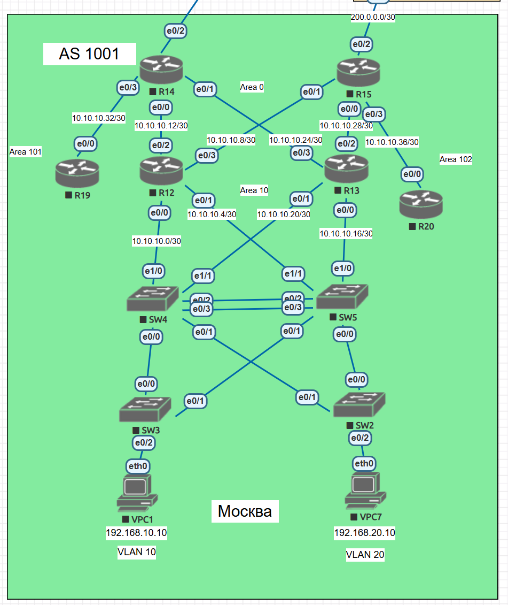
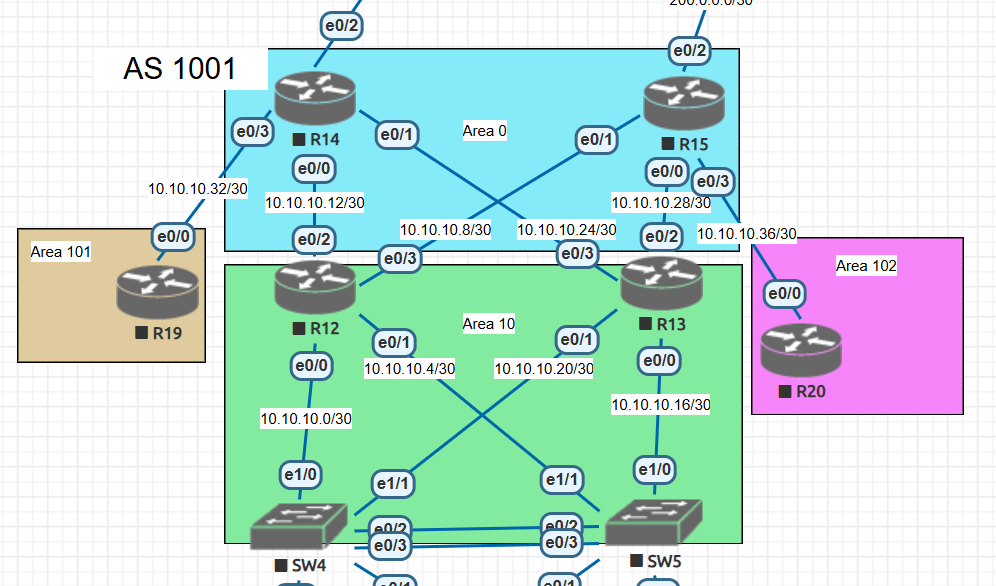

# Фильтрация OSPF

## Цель:
- Настроить OSPF офисе Москва     
- Разделить сеть на зоны  
- Настроить фильтрацию между зонами   


### Описание/Пошаговая инструкция выполнения домашнего задания:     


- Маршрутизаторы R14-R15 находятся в зоне 0 - backbone.
- Маршрутизаторы R12-R13 находятся в зоне 10. Дополнительно к маршрутам должны получать маршрут по умолчанию.
- Маршрутизатор R19 находится в зоне 101 и получает только маршрут по умолчанию.
- Маршрутизатор R20 находится в зоне 102 и получает все маршруты, кроме маршрутов до сетей зоны 101.
- Настройка для IPv6 повторяет логику IPv4.
- План работы и изменения зафиксированы в документации .

# Топология



## Подготовка
Запускаем процесс ospf на всех устройствах, задаем RID по принципу X.X.X.X, где X - номер устройства, запускаем ospf на интерфейсах, анонсируем сети и лупбэки:

</code></pre>
</details>
<details>
<summary>R12</summary>
<pre><code>
!
interface Loopback0
 ip address 1.1.1.12 255.255.255.255
!
interface Ethernet0/0
 ip address 10.10.10.1 255.255.255.252
 ip ospf 1 area 10
!
interface Ethernet0/1
 ip address 10.10.10.5 255.255.255.252
 ip ospf 1 area 10
!
interface Ethernet0/2
 ip address 10.10.10.9 255.255.255.252
 ip ospf 1 area 0
!
interface Ethernet0/3
 ip address 10.10.10.13 255.255.255.252
 ip ospf 1 area 0
!
interface Ethernet1/0
 no ip address
 shutdown
!
interface Ethernet1/1
 no ip address
 shutdown
!
interface Ethernet1/2
 no ip address
 shutdown
!
interface Ethernet1/3
 no ip address
 shutdown
!
router ospf 1
 router-id 12.12.12.12
 network 1.1.1.12 0.0.0.0 area 10
 network 10.10.10.0 0.0.0.3 area 10
 network 10.10.10.4 0.0.0.3 area 10
 network 10.10.10.8 0.0.0.3 area 0
 network 10.10.10.12 0.0.0.3 area 0

!

</code></pre>
</details>


</code></pre>
</details>
<details>
<summary>R13</summary>
<pre><code>

!
interface Loopback0
 ip address 1.1.1.13 255.255.255.255
!
interface Ethernet0/0
 ip address 10.10.10.17 255.255.255.252
 ip ospf 1 area 10
!
interface Ethernet0/1
 ip address 10.10.10.21 255.255.255.252
 ip ospf 1 area 10
!
interface Ethernet0/2
 ip address 10.10.10.25 255.255.255.252
 ip ospf 1 area 0
!
interface Ethernet0/3
 ip address 10.10.10.29 255.255.255.252
 ip ospf 1 area 0
!
interface Ethernet1/0
 no ip address
 shutdown
!
interface Ethernet1/1
 no ip address
 shutdown
!
interface Ethernet1/2
 no ip address
 shutdown
!
interface Ethernet1/3
 no ip address
 shutdown
!
router ospf 1
 router-id 13.13.13.13
 network 1.1.1.13 0.0.0.0 area 10
 network 10.10.10.16 0.0.0.3 area 10
 network 10.10.10.20 0.0.0.3 area 10
 network 10.10.10.24 0.0.0.3 area 0
 network 10.10.10.28 0.0.0.3 area 0

!

</code></pre>
</details>


</code></pre>
</details>
<details>
<summary>R14</summary>
<pre><code>

!
interface Loopback0
 ip address 1.1.1.14 255.255.255.255
!
interface Ethernet0/0
 ip address 10.10.10.10 255.255.255.252
 ip ospf 1 area 0
!
interface Ethernet0/1
 ip address 10.10.10.30 255.255.255.252
 ip ospf 1 area 0
!
interface Ethernet0/2
 ip address 100.0.0.2 255.255.255.252
!
interface Ethernet0/3
 ip address 10.10.10.33 255.255.255.252
 ip ospf 1 area 101
!
router ospf 1
 router-id 14.14.14.14
 network 1.1.1.14 0.0.0.0 area 0
 network 10.10.10.12 0.0.0.3 area 0
 network 10.10.10.24 0.0.0.3 area 0
 network 10.10.10.32 0.0.0.3 area 101

!

</code></pre>
</details>


</code></pre>
</details>
<details>
<summary>R15</summary>
<pre><code>

!
interface Loopback0
 ip address 1.1.1.15 255.255.255.255
!
interface Ethernet0/0
 ip address 10.10.10.26 255.255.255.252
 ip ospf 1 area 0
!
interface Ethernet0/1
 ip address 10.10.10.14 255.255.255.252
 ip ospf 1 area 0
!
interface Ethernet0/2
 ip address 200.0.0.2 255.255.255.252
!
interface Ethernet0/3
 ip address 10.10.10.37 255.255.255.252
 ip ospf 1 area 102
!
router ospf 1
 router-id 15.15.15.15
 network 1.1.1.15 0.0.0.0 area 0
 network 10.10.10.8 0.0.0.3 area 0
 network 10.10.10.28 0.0.0.3 area 0
 network 10.10.10.36 0.0.0.3 area 102

!

</code></pre>
</details>


</code></pre>
</details>
<details>
<summary>R19</summary>
<pre><code>

!
interface Loopback0
 ip address 1.1.1.19 255.255.255.255
!
interface Ethernet0/0
 ip address 10.10.10.34 255.255.255.252
 ip ospf 1 area 101
!
interface Ethernet0/1
 no ip address
 shutdown
!
interface Ethernet0/2
 no ip address
 shutdown
!
interface Ethernet0/3
 no ip address
 shutdown
!
router ospf 1
 router-id 19.19.19.19
 network 1.1.1.19 0.0.0.0 area 101
 network 10.10.10.32 0.0.0.3 area 101

!
ip forward-protocol nd
!

</code></pre>
</details>


</code></pre>
</details>
<details>
<summary>R20</summary>
<pre><code>

!
interface Loopback0
 ip address 1.1.1.20 255.255.255.255
!
interface Ethernet0/0
 ip address 10.10.10.38 255.255.255.252
 ip ospf 1 area 102
!
interface Ethernet0/1
 no ip address
 shutdown
!
interface Ethernet0/2
 no ip address
 shutdown
!
interface Ethernet0/3
 no ip address
 shutdown
!
router ospf 1
 router-id 20.20.20.20
 network 1.1.1.20 0.0.0.0 area 102
 network 10.10.10.36 0.0.0.3 area 102

!

</code></pre>
</details>


</code></pre>
</details>
<details>
<summary>SW4</summary>
<pre><code>

!
interface Loopback0
 ip address 1.1.1.4 255.255.255.255
!
interface Port-channel1
 switchport trunk allowed vlan 10,20,100
 switchport trunk encapsulation dot1q
 switchport mode trunk
!
interface Ethernet0/0
 switchport trunk allowed vlan 10,20,100
 switchport trunk encapsulation dot1q
 switchport mode trunk
!
interface Ethernet0/1
 switchport trunk allowed vlan 10,20,100
 switchport trunk encapsulation dot1q
 switchport mode trunk
!
interface Ethernet0/2
 switchport trunk allowed vlan 10,20,100
 switchport trunk encapsulation dot1q
 switchport mode trunk
 channel-protocol lacp
 channel-group 1 mode active
!
interface Ethernet0/3
 switchport trunk allowed vlan 10,20,100
 switchport trunk encapsulation dot1q
 switchport mode trunk
 channel-protocol lacp
 channel-group 1 mode active
!
interface Ethernet1/0
 no switchport
 ip address 10.10.10.2 255.255.255.252
 ip ospf 1 area 10
 duplex auto
!
interface Ethernet1/1
 no switchport
 ip address 10.10.10.22 255.255.255.252
 ip ospf 1 area 10
 duplex auto
!
interface Ethernet1/2
 switchport access vlan 999
 switchport mode access
 shutdown
!
interface Ethernet1/3
 switchport access vlan 999
 switchport mode access
 shutdown
!
interface Vlan10
 ip address 192.168.10.2 255.255.255.0
 vrrp 10 ip 192.168.10.1
!
interface Vlan20
 ip address 192.168.20.2 255.255.255.0
 vrrp 20 ip 192.168.20.1
 vrrp 20 priority 200
!
router ospf 1
 router-id 4.4.4.4
 network 1.1.1.4 0.0.0.0 area 10
 network 10.10.10.0 0.0.0.3 area 10
 network 10.10.10.20 0.0.0.3 area 10

!

</code></pre>
</details>


</code></pre>
</details>
<details>
<summary>SW5</summary>
<pre><code>
!
interface Loopback0
 ip address 1.1.1.5 255.255.255.255
!
interface Port-channel1
 switchport trunk allowed vlan 10,20,100
 switchport trunk encapsulation dot1q
 switchport mode trunk
!
interface Ethernet0/0
 switchport trunk allowed vlan 10,20,100
 switchport trunk encapsulation dot1q
 switchport mode trunk
!
interface Ethernet0/1
 switchport trunk allowed vlan 10,20,100
 switchport trunk encapsulation dot1q
 switchport mode trunk
!
interface Ethernet0/2
 switchport trunk allowed vlan 10,20,100
 switchport trunk encapsulation dot1q
 switchport mode trunk
 channel-protocol lacp
 channel-group 1 mode passive
!
interface Ethernet0/3
 switchport trunk allowed vlan 10,20,100
 switchport trunk encapsulation dot1q
 switchport mode trunk
 channel-protocol lacp
 channel-group 1 mode passive
!
interface Ethernet1/0
 no switchport
 ip address 10.10.10.18 255.255.255.252
 ip ospf 1 area 10
 duplex auto
!
interface Ethernet1/1
 no switchport
 ip address 10.10.10.6 255.255.255.252
 ip ospf 1 area 10
 duplex auto
!
interface Ethernet1/2
 switchport access vlan 999
 switchport mode access
 shutdown
!
interface Ethernet1/3
 switchport access vlan 999
 switchport mode access
 shutdown
!
interface Vlan10
 ip address 192.168.10.3 255.255.255.0
 vrrp 10 ip 192.168.10.1
 vrrp 10 priority 200
!
interface Vlan20
 ip address 192.168.20.3 255.255.255.0
 vrrp 20 ip 192.168.20.1
!
router ospf 1
 router-id 5.5.5.5
 network 1.1.1.5 0.0.0.0 area 10
 network 10.10.10.4 0.0.0.3 area 10
 network 10.10.10.16 0.0.0.3 area 10

!

</code></pre>
</details>

Анонсируем маршрут по умолчанию:
```
R14(config-router)#default-information originate
```
</code></pre>
</details>
<details>
<summary>Area 101</summary>
<pre><code>

R19#sh ip route ospf
Codes: L - local, C - connected, S - static, R - RIP, M - mobile, B - BGP
       D - EIGRP, EX - EIGRP external, O - OSPF, IA - OSPF inter area
       N1 - OSPF NSSA external type 1, N2 - OSPF NSSA external type 2
       E1 - OSPF external type 1, E2 - OSPF external type 2
       i - IS-IS, su - IS-IS summary, L1 - IS-IS level-1, L2 - IS-IS level-2
       ia - IS-IS inter area, * - candidate default, U - per-user static route
       o - ODR, P - periodic downloaded static route, H - NHRP, l - LISP
       a - application route
       + - replicated route, % - next hop override

Gateway of last resort is 10.10.10.33 to network 0.0.0.0

O*E2  0.0.0.0/0 [110/1] via 10.10.10.33, 00:00:57, Ethernet0/0
      10.0.0.0/8 is variably subnetted, 11 subnets, 2 masks
O IA     10.10.10.0/30 [110/30] via 10.10.10.33, 00:19:17, Ethernet0/0
O IA     10.10.10.4/30 [110/30] via 10.10.10.33, 00:19:17, Ethernet0/0
O IA     10.10.10.8/30 [110/20] via 10.10.10.33, 00:19:21, Ethernet0/0
O IA     10.10.10.12/30 [110/30] via 10.10.10.33, 00:19:17, Ethernet0/0
O IA     10.10.10.16/30 [110/30] via 10.10.10.33, 00:19:17, Ethernet0/0
O IA     10.10.10.20/30 [110/30] via 10.10.10.33, 00:19:17, Ethernet0/0
O IA     10.10.10.24/30 [110/30] via 10.10.10.33, 00:19:17, Ethernet0/0
O IA     10.10.10.28/30 [110/20] via 10.10.10.33, 00:19:21, Ethernet0/0
O IA     10.10.10.36/30 [110/40] via 10.10.10.33, 00:19:17, Ethernet0/0

</code></pre>
</details>

</code></pre>
</details>
<details>
<summary>Area 102</summary>
<pre><code>

R20#sh ip route ospf
Codes: L - local, C - connected, S - static, R - RIP, M - mobile, B - BGP
       D - EIGRP, EX - EIGRP external, O - OSPF, IA - OSPF inter area
       N1 - OSPF NSSA external type 1, N2 - OSPF NSSA external type 2
       E1 - OSPF external type 1, E2 - OSPF external type 2
       i - IS-IS, su - IS-IS summary, L1 - IS-IS level-1, L2 - IS-IS level-2
       ia - IS-IS inter area, * - candidate default, U - per-user static route
       o - ODR, P - periodic downloaded static route, H - NHRP, l - LISP
       a - application route
       + - replicated route, % - next hop override

Gateway of last resort is 10.10.10.37 to network 0.0.0.0

O*E2  0.0.0.0/0 [110/1] via 10.10.10.37, 00:04:28, Ethernet0/0
      10.0.0.0/8 is variably subnetted, 11 subnets, 2 masks
O IA     10.10.10.0/30 [110/30] via 10.10.10.37, 00:22:56, Ethernet0/0
O IA     10.10.10.4/30 [110/30] via 10.10.10.37, 00:22:56, Ethernet0/0
O IA     10.10.10.8/30 [110/30] via 10.10.10.37, 00:22:56, Ethernet0/0
O IA     10.10.10.12/30 [110/20] via 10.10.10.37, 00:23:06, Ethernet0/0
O IA     10.10.10.16/30 [110/30] via 10.10.10.37, 00:22:56, Ethernet0/0
O IA     10.10.10.20/30 [110/30] via 10.10.10.37, 00:22:56, Ethernet0/0
O IA     10.10.10.24/30 [110/20] via 10.10.10.37, 00:23:06, Ethernet0/0
O IA     10.10.10.28/30 [110/30] via 10.10.10.37, 00:22:51, Ethernet0/0
O IA     10.10.10.32/30 [110/40] via 10.10.10.37, 00:22:56, Ethernet0/0

</code></pre>
</details>

</code></pre>
</details>
<details>
<summary>Area 10</summary>
<pre><code>
SW4#sh ip route ospf
Codes: L - local, C - connected, S - static, R - RIP, M - mobile, B - BGP
       D - EIGRP, EX - EIGRP external, O - OSPF, IA - OSPF inter area
       N1 - OSPF NSSA external type 1, N2 - OSPF NSSA external type 2
       E1 - OSPF external type 1, E2 - OSPF external type 2
       i - IS-IS, su - IS-IS summary, L1 - IS-IS level-1, L2 - IS-IS level-2
       ia - IS-IS inter area, * - candidate default, U - per-user static route
       o - ODR, P - periodic downloaded static route, H - NHRP, l - LISP
       a - application route
       + - replicated route, % - next hop override

Gateway of last resort is 10.10.10.21 to network 0.0.0.0

O*E2  0.0.0.0/0 [110/1] via 10.10.10.21, 00:01:22, Ethernet1/1
                [110/1] via 10.10.10.1, 00:01:22, Ethernet1/0
      10.0.0.0/8 is variably subnetted, 12 subnets, 2 masks
O        10.10.10.4/30 [110/20] via 10.10.10.1, 00:19:54, Ethernet1/0
O IA     10.10.10.8/30 [110/20] via 10.10.10.1, 00:19:54, Ethernet1/0
O IA     10.10.10.12/30 [110/20] via 10.10.10.1, 00:19:54, Ethernet1/0
O        10.10.10.16/30 [110/20] via 10.10.10.21, 00:19:54, Ethernet1/1
O IA     10.10.10.24/30 [110/20] via 10.10.10.21, 00:19:54, Ethernet1/1
O IA     10.10.10.28/30 [110/20] via 10.10.10.21, 00:19:44, Ethernet1/1
O IA     10.10.10.32/30 [110/30] via 10.10.10.21, 00:19:40, Ethernet1/1
                        [110/30] via 10.10.10.1, 00:19:54, Ethernet1/0
O IA     10.10.10.36/30 [110/30] via 10.10.10.21, 00:19:50, Ethernet1/1
                        [110/30] via 10.10.10.1, 00:19:54, Ethernet1/0

</code></pre>
</details>

## Маршрутизаторы R14-R15 находятся в зоне 0 - backbone.

</code></pre>
</details>
<details>
<summary>R14</summary>
<pre><code>
R14#sh ip ospf database

            OSPF Router with ID (14.14.14.14) (Process ID 1)

                Router Link States (Area 0)

Link ID         ADV Router      Age         Seq#       Checksum Link count
12.12.12.12     12.12.12.12     435         0x8000000A 0x00FFFF 2
13.13.13.13     13.13.13.13     96          0x80000009 0x003A7E 2
14.14.14.14     14.14.14.14     1180        0x8000000B 0x00A107 3
15.15.15.15     15.15.15.15     867         0x8000000A 0x00DCC5 3

                Net Link States (Area 0)

Link ID         ADV Router      Age         Seq#       Checksum
10.10.10.10     14.14.14.14     162         0x80000006 0x004827
10.10.10.14     15.15.15.15     230         0x80000008 0x002041
10.10.10.26     15.15.15.15     230         0x80000008 0x00D977
10.10.10.30     14.14.14.14     162         0x80000008 0x00ADA7

                Summary Net Link States (Area 0)

Link ID         ADV Router      Age         Seq#       Checksum
1.1.1.4         12.12.12.12     1006        0x80000001 0x0042B8
1.1.1.4         13.13.13.13     1006        0x80000001 0x0024D2
1.1.1.5         12.12.12.12     779         0x80000001 0x0038C1
1.1.1.5         13.13.13.13     779         0x80000001 0x001ADB
1.1.1.12        12.12.12.12     894         0x80000001 0x008D6F
1.1.1.12        13.13.13.13     894         0x80000001 0x0038AC
1.1.1.13        12.12.12.12     922         0x80000001 0x004C9B
1.1.1.13        13.13.13.13     922         0x80000001 0x006592
1.1.1.19        14.14.14.14     1031        0x80000001 0x006F74
1.1.1.20        15.15.15.15     823         0x80000001 0x004797
10.10.10.0      12.12.12.12     435         0x80000007 0x00FCE4
10.10.10.0      13.13.13.13     96          0x80000004 0x00498D
10.10.10.4      12.12.12.12     435         0x80000007 0x00D409
10.10.10.4      13.13.13.13     96          0x80000004 0x0021B1
10.10.10.16     12.12.12.12     435         0x80000004 0x00C604
10.10.10.16     13.13.13.13     96          0x80000007 0x003E8F
10.10.10.20     12.12.12.12     435         0x80000004 0x009E28
10.10.10.20     13.13.13.13     96          0x80000007 0x0016B3
10.10.10.32     14.14.14.14     162         0x80000007 0x007F3A
10.10.10.36     15.15.15.15     230         0x80000004 0x003F75

                Router Link States (Area 101)

Link ID         ADV Router      Age         Seq#       Checksum Link count
14.14.14.14     14.14.14.14     1185        0x8000000A 0x00D855 1
19.19.19.19     19.19.19.19     1037        0x8000000A 0x002BB5 2

                Net Link States (Area 101)

Link ID         ADV Router      Age         Seq#       Checksum
10.10.10.34     19.19.19.19     181         0x80000008 0x00CB59

                Summary Net Link States (Area 101)

Link ID         ADV Router      Age         Seq#       Checksum
1.1.1.4         14.14.14.14     1005        0x80000001 0x006A7E
1.1.1.5         14.14.14.14     778         0x80000001 0x006087
1.1.1.12        14.14.14.14     893         0x80000001 0x00B535
1.1.1.13        14.14.14.14     916         0x80000002 0x00A93F
1.1.1.14        14.14.14.14     1175        0x80000001 0x003DB5
1.1.1.15        14.14.14.14     860         0x80000001 0x00FBE1
1.1.1.20        14.14.14.14     821         0x80000001 0x002EA0
10.10.10.0      14.14.14.14     162         0x80000004 0x002BA7
10.10.10.4      14.14.14.14     162         0x80000004 0x0003CB
10.10.10.8      14.14.14.14     162         0x80000007 0x007061
10.10.10.12     14.14.14.14     162         0x80000004 0x00B214
10.10.10.16     14.14.14.14     162         0x80000004 0x008A38
10.10.10.20     14.14.14.14     162         0x80000004 0x00625C
10.10.10.24     14.14.14.14     162         0x80000004 0x003A80
10.10.10.28     14.14.14.14     162         0x80000007 0x00A716
10.10.10.36     14.14.14.14     162         0x80000004 0x00267E

                Type-5 AS External Link States

Link ID         ADV Router      Age         Seq#       Checksum Tag
0.0.0.0         14.14.14.14     1185        0x80000003 0x0091E6 1
R14#


</code></pre>
</details>

</code></pre>
</details>
<details>
<summary>R15</summary>
<pre><code>
R15#sh ip ospf database

            OSPF Router with ID (15.15.15.15) (Process ID 1)

                Router Link States (Area 0)

Link ID         ADV Router      Age         Seq#       Checksum Link count
12.12.12.12     12.12.12.12     548         0x8000000A 0x00FFFF 2
13.13.13.13     13.13.13.13     209         0x80000009 0x003A7E 2
14.14.14.14     14.14.14.14     1295        0x8000000B 0x00A107 3
15.15.15.15     15.15.15.15     979         0x8000000A 0x00DCC5 3

                Net Link States (Area 0)

Link ID         ADV Router      Age         Seq#       Checksum
10.10.10.10     14.14.14.14     277         0x80000006 0x004827
10.10.10.14     15.15.15.15     342         0x80000008 0x002041
10.10.10.26     15.15.15.15     342         0x80000008 0x00D977
10.10.10.30     14.14.14.14     277         0x80000008 0x00ADA7

                Summary Net Link States (Area 0)

Link ID         ADV Router      Age         Seq#       Checksum
1.1.1.4         12.12.12.12     1119        0x80000001 0x0042B8
1.1.1.4         13.13.13.13     1119        0x80000001 0x0024D2
1.1.1.5         12.12.12.12     892         0x80000001 0x0038C1
1.1.1.5         13.13.13.13     892         0x80000001 0x001ADB
1.1.1.12        12.12.12.12     1007        0x80000001 0x008D6F
1.1.1.12        13.13.13.13     1007        0x80000001 0x0038AC
1.1.1.13        12.12.12.12     1035        0x80000001 0x004C9B
1.1.1.13        13.13.13.13     1035        0x80000001 0x006592
1.1.1.19        14.14.14.14     1147        0x80000001 0x006F74
1.1.1.20        15.15.15.15     935         0x80000001 0x004797
10.10.10.0      12.12.12.12     548         0x80000007 0x00FCE4
10.10.10.0      13.13.13.13     209         0x80000004 0x00498D
10.10.10.4      12.12.12.12     548         0x80000007 0x00D409
10.10.10.4      13.13.13.13     209         0x80000004 0x0021B1
10.10.10.16     12.12.12.12     548         0x80000004 0x00C604
10.10.10.16     13.13.13.13     209         0x80000007 0x003E8F
10.10.10.20     12.12.12.12     548         0x80000004 0x009E28
10.10.10.20     13.13.13.13     209         0x80000007 0x0016B3
10.10.10.32     14.14.14.14     277         0x80000007 0x007F3A
10.10.10.36     15.15.15.15     342         0x80000004 0x003F75

                Router Link States (Area 102)

Link ID         ADV Router      Age         Seq#       Checksum Link count
15.15.15.15     15.15.15.15     342         0x80000009 0x00E838 1
20.20.20.20     20.20.20.20     941         0x80000009 0x00AB25 2

                Net Link States (Area 102)

Link ID         ADV Router      Age         Seq#       Checksum
10.10.10.38     20.20.20.20     227         0x80000006 0x00DD39

                Summary Net Link States (Area 102)

Link ID         ADV Router      Age         Seq#       Checksum
1.1.1.4         15.15.15.15     1118        0x80000001 0x004C98
1.1.1.5         15.15.15.15     891         0x80000001 0x0042A1
1.1.1.12        15.15.15.15     1006        0x80000001 0x00974F
1.1.1.13        15.15.15.15     1029        0x80000002 0x008B59
1.1.1.14        15.15.15.15     1288        0x80000001 0x00E7F2
1.1.1.15        15.15.15.15     974         0x80000001 0x0015D8
1.1.1.19        15.15.15.15     1145        0x80000001 0x001AB1
10.10.10.0      15.15.15.15     342         0x80000004 0x000DC1
10.10.10.4      15.15.15.15     342         0x80000004 0x00E4E5
10.10.10.8      15.15.15.15     342         0x80000004 0x00BC0A
10.10.10.12     15.15.15.15     342         0x80000007 0x002A9F
10.10.10.16     15.15.15.15     342         0x80000004 0x006C52
10.10.10.20     15.15.15.15     342         0x80000004 0x004476
10.10.10.24     15.15.15.15     342         0x80000007 0x00B10C
10.10.10.28     15.15.15.15     342         0x80000004 0x00F3BE
10.10.10.32     15.15.15.15     342         0x80000004 0x003074

                Summary ASB Link States (Area 102)

Link ID         ADV Router      Age         Seq#       Checksum
14.14.14.14     15.15.15.15     1343        0x80000003 0x00F5BB

                Type-5 AS External Link States

Link ID         ADV Router      Age         Seq#       Checksum Tag
0.0.0.0         14.14.14.14     1300        0x80000003 0x0091E6 1
R15#


</code></pre>
</details>


## Маршрутизаторы R12-R13 находятся в зоне 10. Дополнительно к маршрутам должны получать маршрут по умолчанию.
</code></pre>
</details>
<details>
<summary>R12</summary>
<pre><code>
R12#sh ip route ospf
Codes: L - local, C - connected, S - static, R - RIP, M - mobile, B - BGP
       D - EIGRP, EX - EIGRP external, O - OSPF, IA - OSPF inter area
       N1 - OSPF NSSA external type 1, N2 - OSPF NSSA external type 2
       E1 - OSPF external type 1, E2 - OSPF external type 2
       i - IS-IS, su - IS-IS summary, L1 - IS-IS level-1, L2 - IS-IS level-2
       ia - IS-IS inter area, * - candidate default, U - per-user static route
       o - ODR, P - periodic downloaded static route, H - NHRP, l - LISP
       a - application route
       + - replicated route, % - next hop override

Gateway of last resort is 10.10.10.10 to network 0.0.0.0

O*E2  0.0.0.0/0 [110/1] via 10.10.10.10, 01:27:26, Ethernet0/2
      1.0.0.0/32 is subnetted, 8 subnets
O        1.1.1.4 [110/11] via 10.10.10.2, 00:20:10, Ethernet0/0
O        1.1.1.5 [110/11] via 10.10.10.6, 00:16:23, Ethernet0/1
O        1.1.1.13 [110/21] via 10.10.10.6, 00:18:46, Ethernet0/1
                  [110/21] via 10.10.10.2, 00:18:46, Ethernet0/0
O        1.1.1.14 [110/11] via 10.10.10.10, 00:23:00, Ethernet0/2
O        1.1.1.15 [110/11] via 10.10.10.14, 00:17:46, Ethernet0/3
O IA     1.1.1.19 [110/21] via 10.10.10.10, 00:20:37, Ethernet0/2
O IA     1.1.1.20 [110/21] via 10.10.10.14, 00:17:06, Ethernet0/3
      10.0.0.0/8 is variably subnetted, 14 subnets, 2 masks
O        10.10.10.16/30 [110/20] via 10.10.10.6, 01:45:54, Ethernet0/1
O        10.10.10.20/30 [110/20] via 10.10.10.2, 01:45:54, Ethernet0/0
O        10.10.10.24/30 [110/20] via 10.10.10.14, 01:45:54, Ethernet0/3
O        10.10.10.28/30 [110/20] via 10.10.10.10, 01:45:44, Ethernet0/2
O IA     10.10.10.32/30 [110/20] via 10.10.10.10, 01:45:54, Ethernet0/2
O IA     10.10.10.36/30 [110/20] via 10.10.10.14, 01:45:54, Ethernet0/3
R12#
R12#sh ip ospf database

            OSPF Router with ID (12.12.12.12) (Process ID 1)

                Router Link States (Area 0)

Link ID         ADV Router      Age         Seq#       Checksum Link count
12.12.12.12     12.12.12.12     927         0x8000000A 0x00FFFF 2
13.13.13.13     13.13.13.13     590         0x80000009 0x003A7E 2
14.14.14.14     14.14.14.14     1674        0x8000000B 0x00A107 3
15.15.15.15     15.15.15.15     1359        0x8000000A 0x00DCC5 3

                Net Link States (Area 0)

Link ID         ADV Router      Age         Seq#       Checksum
10.10.10.10     14.14.14.14     656         0x80000006 0x004827
10.10.10.14     15.15.15.15     723         0x80000008 0x002041
10.10.10.26     15.15.15.15     723         0x80000008 0x00D977
10.10.10.30     14.14.14.14     656         0x80000008 0x00ADA7

                Summary Net Link States (Area 0)

Link ID         ADV Router      Age         Seq#       Checksum
1.1.1.4         12.12.12.12     1498        0x80000001 0x0042B8
1.1.1.4         13.13.13.13     1500        0x80000001 0x0024D2
1.1.1.5         12.12.12.12     1271        0x80000001 0x0038C1
1.1.1.5         13.13.13.13     1273        0x80000001 0x001ADB
1.1.1.12        12.12.12.12     1386        0x80000001 0x008D6F
1.1.1.12        13.13.13.13     1388        0x80000001 0x0038AC
1.1.1.13        12.12.12.12     1414        0x80000001 0x004C9B
1.1.1.13        13.13.13.13     1416        0x80000001 0x006592
1.1.1.19        14.14.14.14     1526        0x80000001 0x006F74
1.1.1.20        15.15.15.15     1315        0x80000001 0x004797
10.10.10.0      12.12.12.12     927         0x80000007 0x00FCE4
10.10.10.0      13.13.13.13     590         0x80000004 0x00498D
10.10.10.4      12.12.12.12     927         0x80000007 0x00D409
10.10.10.4      13.13.13.13     590         0x80000004 0x0021B1
10.10.10.16     12.12.12.12     927         0x80000004 0x00C604
10.10.10.16     13.13.13.13     590         0x80000007 0x003E8F
10.10.10.20     12.12.12.12     927         0x80000004 0x009E28
10.10.10.20     13.13.13.13     590         0x80000007 0x0016B3
10.10.10.32     14.14.14.14     656         0x80000007 0x007F3A
10.10.10.36     15.15.15.15     723         0x80000004 0x003F75

                Router Link States (Area 10)

Link ID         ADV Router      Age         Seq#       Checksum Link count
4.4.4.4         4.4.4.4         1504        0x80000009 0x0037F2 3
5.5.5.5         5.5.5.5         785         0x8000000A 0x0074AB 3
12.12.12.12     12.12.12.12     927         0x8000000B 0x00E020 3
13.13.13.13     13.13.13.13     1421        0x80000009 0x002A8F 3

                Net Link States (Area 10)

Link ID         ADV Router      Age         Seq#       Checksum
10.10.10.1      12.12.12.12     927         0x80000008 0x0005A1
10.10.10.5      12.12.12.12     927         0x80000008 0x000F8F
10.10.10.17     13.13.13.13     590         0x80000008 0x009AEF
10.10.10.21     13.13.13.13     590         0x80000008 0x00404A

                Summary Net Link States (Area 10)

Link ID         ADV Router      Age         Seq#       Checksum
1.1.1.14        12.12.12.12     1668        0x80000001 0x00DD13
1.1.1.14        13.13.13.13     1670        0x80000001 0x00BF2D
1.1.1.15        12.12.12.12     1353        0x80000001 0x00D31C
1.1.1.15        13.13.13.13     1355        0x80000001 0x00B536
1.1.1.19        12.12.12.12     1525        0x80000001 0x0010D1
1.1.1.19        13.13.13.13     1527        0x80000001 0x00F1EB
1.1.1.20        12.12.12.12     1314        0x80000001 0x0006DA
1.1.1.20        13.13.13.13     1316        0x80000001 0x00E7F4
10.10.10.8      12.12.12.12     927         0x80000008 0x00AA2E
10.10.10.8      13.13.13.13     590         0x80000005 0x00F6D6
10.10.10.12     12.12.12.12     927         0x80000008 0x008252
10.10.10.12     13.13.13.13     590         0x80000004 0x00D0F9
10.10.10.24     12.12.12.12     927         0x80000004 0x00764C
10.10.10.24     13.13.13.13     590         0x80000007 0x00EDD7
10.10.10.28     12.12.12.12     927         0x80000004 0x004E70
10.10.10.28     13.13.13.13     590         0x80000004 0x00CBF8
10.10.10.32     12.12.12.12     927         0x80000008 0x001E98
10.10.10.32     13.13.13.13     590         0x80000009 0x00FDB3
10.10.10.36     12.12.12.12     927         0x80000008 0x00F5BC
10.10.10.36     13.13.13.13     590         0x80000008 0x00D7D6

                Summary ASB Link States (Area 10)

Link ID         ADV Router      Age         Seq#       Checksum
14.14.14.14     12.12.12.12     1692        0x80000003 0x00EBDB
14.14.14.14     13.13.13.13     1573        0x80000003 0x00CDF5

                Type-5 AS External Link States

Link ID         ADV Router      Age         Seq#       Checksum Tag
0.0.0.0         14.14.14.14     1679        0x80000003 0x0091E6 1

</code></pre>
</details>

</code></pre>
</details>
<details>
<summary>R13</summary>
<pre><code>
R13#sh ip route ospf
Codes: L - local, C - connected, S - static, R - RIP, M - mobile, B - BGP
       D - EIGRP, EX - EIGRP external, O - OSPF, IA - OSPF inter area
       N1 - OSPF NSSA external type 1, N2 - OSPF NSSA external type 2
       E1 - OSPF external type 1, E2 - OSPF external type 2
       i - IS-IS, su - IS-IS summary, L1 - IS-IS level-1, L2 - IS-IS level-2
       ia - IS-IS inter area, * - candidate default, U - per-user static route
       o - ODR, P - periodic downloaded static route, H - NHRP, l - LISP
       a - application route
       + - replicated route, % - next hop override

Gateway of last resort is 10.10.10.30 to network 0.0.0.0

O*E2  0.0.0.0/0 [110/1] via 10.10.10.30, 01:28:00, Ethernet0/3
      1.0.0.0/32 is subnetted, 8 subnets
O        1.1.1.4 [110/11] via 10.10.10.22, 00:20:44, Ethernet0/1
O        1.1.1.5 [110/11] via 10.10.10.18, 00:16:57, Ethernet0/0
O        1.1.1.12 [110/21] via 10.10.10.22, 00:18:51, Ethernet0/1
                  [110/21] via 10.10.10.18, 00:18:51, Ethernet0/0
O        1.1.1.14 [110/11] via 10.10.10.30, 00:23:34, Ethernet0/3
O        1.1.1.15 [110/11] via 10.10.10.26, 00:18:19, Ethernet0/2
O IA     1.1.1.19 [110/21] via 10.10.10.30, 00:21:10, Ethernet0/3
O IA     1.1.1.20 [110/21] via 10.10.10.26, 00:17:40, Ethernet0/2
      10.0.0.0/8 is variably subnetted, 14 subnets, 2 masks
O        10.10.10.0/30 [110/20] via 10.10.10.22, 01:46:28, Ethernet0/1
O        10.10.10.4/30 [110/20] via 10.10.10.18, 01:46:28, Ethernet0/0
O        10.10.10.8/30 [110/20] via 10.10.10.30, 01:46:18, Ethernet0/3
O        10.10.10.12/30 [110/20] via 10.10.10.26, 01:46:28, Ethernet0/2
O IA     10.10.10.32/30 [110/20] via 10.10.10.30, 01:46:18, Ethernet0/3
O IA     10.10.10.36/30 [110/20] via 10.10.10.26, 01:46:28, Ethernet0/2
R13#
R13#sh ip ospf database

            OSPF Router with ID (13.13.13.13) (Process ID 1)

                Router Link States (Area 0)

Link ID         ADV Router      Age         Seq#       Checksum Link count
12.12.12.12     12.12.12.12     970         0x8000000A 0x00FFFF 2
13.13.13.13     13.13.13.13     629         0x80000009 0x003A7E 2
14.14.14.14     14.14.14.14     1715        0x8000000B 0x00A107 3
15.15.15.15     15.15.15.15     1400        0x8000000A 0x00DCC5 3

                Net Link States (Area 0)

Link ID         ADV Router      Age         Seq#       Checksum
10.10.10.10     14.14.14.14     697         0x80000006 0x004827
10.10.10.14     15.15.15.15     763         0x80000008 0x002041
10.10.10.26     15.15.15.15     763         0x80000008 0x00D977
10.10.10.30     14.14.14.14     697         0x80000008 0x00ADA7

                Summary Net Link States (Area 0)

Link ID         ADV Router      Age         Seq#       Checksum
1.1.1.4         12.12.12.12     1541        0x80000001 0x0042B8
1.1.1.4         13.13.13.13     1539        0x80000001 0x0024D2
1.1.1.5         12.12.12.12     1314        0x80000001 0x0038C1
1.1.1.5         13.13.13.13     1312        0x80000001 0x001ADB
1.1.1.12        12.12.12.12     1428        0x80000001 0x008D6F
1.1.1.12        13.13.13.13     1426        0x80000001 0x0038AC
1.1.1.13        12.12.12.12     1457        0x80000001 0x004C9B
1.1.1.13        13.13.13.13     1455        0x80000001 0x006592
1.1.1.19        14.14.14.14     1566        0x80000001 0x006F74
1.1.1.20        15.15.15.15     1356        0x80000001 0x004797
10.10.10.0      12.12.12.12     970         0x80000007 0x00FCE4
10.10.10.0      13.13.13.13     629         0x80000004 0x00498D
10.10.10.4      12.12.12.12     970         0x80000007 0x00D409
10.10.10.4      13.13.13.13     629         0x80000004 0x0021B1
10.10.10.16     12.12.12.12     970         0x80000004 0x00C604
10.10.10.16     13.13.13.13     629         0x80000007 0x003E8F
10.10.10.20     12.12.12.12     970         0x80000004 0x009E28
10.10.10.20     13.13.13.13     629         0x80000007 0x0016B3
10.10.10.32     14.14.14.14     697         0x80000007 0x007F3A
10.10.10.36     15.15.15.15     763         0x80000004 0x003F75

                Router Link States (Area 10)

Link ID         ADV Router      Age         Seq#       Checksum Link count
4.4.4.4         4.4.4.4         1545        0x80000009 0x0037F2 3
5.5.5.5         5.5.5.5         826         0x8000000A 0x0074AB 3
12.12.12.12     12.12.12.12     970         0x8000000B 0x00E020 3
13.13.13.13     13.13.13.13     1460        0x80000009 0x002A8F 3

                Net Link States (Area 10)

Link ID         ADV Router      Age         Seq#       Checksum
10.10.10.1      12.12.12.12     970         0x80000008 0x0005A1
10.10.10.5      12.12.12.12     970         0x80000008 0x000F8F
10.10.10.17     13.13.13.13     629         0x80000008 0x009AEF
10.10.10.21     13.13.13.13     629         0x80000008 0x00404A

                Summary Net Link States (Area 10)

Link ID         ADV Router      Age         Seq#       Checksum
1.1.1.14        12.12.12.12     1711        0x80000001 0x00DD13
1.1.1.14        13.13.13.13     1709        0x80000001 0x00BF2D
1.1.1.15        12.12.12.12     1396        0x80000001 0x00D31C
1.1.1.15        13.13.13.13     1394        0x80000001 0x00B536
1.1.1.19        12.12.12.12     1567        0x80000001 0x0010D1
1.1.1.19        13.13.13.13     1565        0x80000001 0x00F1EB
1.1.1.20        12.12.12.12     1357        0x80000001 0x0006DA
1.1.1.20        13.13.13.13     1355        0x80000001 0x00E7F4
10.10.10.8      12.12.12.12     970         0x80000008 0x00AA2E
10.10.10.8      13.13.13.13     629         0x80000005 0x00F6D6
10.10.10.12     12.12.12.12     970         0x80000008 0x008252
10.10.10.12     13.13.13.13     629         0x80000004 0x00D0F9
10.10.10.24     12.12.12.12     970         0x80000004 0x00764C
10.10.10.24     13.13.13.13     629         0x80000007 0x00EDD7
10.10.10.28     12.12.12.12     970         0x80000004 0x004E70
10.10.10.28     13.13.13.13     629         0x80000004 0x00CBF8
10.10.10.32     12.12.12.12     970         0x80000008 0x001E98
10.10.10.32     13.13.13.13     629         0x80000009 0x00FDB3
10.10.10.36     12.12.12.12     970         0x80000008 0x00F5BC
10.10.10.36     13.13.13.13     629         0x80000008 0x00D7D6

                Summary ASB Link States (Area 10)

Link ID         ADV Router      Age         Seq#       Checksum
14.14.14.14     12.12.12.12     1735        0x80000003 0x00EBDB
14.14.14.14     13.13.13.13     1612        0x80000003 0x00CDF5

                Type-5 AS External Link States

Link ID         ADV Router      Age         Seq#       Checksum Tag
0.0.0.0         14.14.14.14     1720        0x80000003 0x0091E6 1
R13#

</code></pre>
</details>
 
Маршрут E*O2 0.0.0.0/0 присутствует в таблице маршрутизации

## Маршрутизатор R19 находится в зоне 101 и получает только маршрут по умолчанию.

Текущая таблица маршрутизации:
</code></pre>
</details>
<details>
<summary>R19</summary>
<pre><code>

R19>sh ip route ospf
Codes: L - local, C - connected, S - static, R - RIP, M - mobile, B - BGP
       D - EIGRP, EX - EIGRP external, O - OSPF, IA - OSPF inter area
       N1 - OSPF NSSA external type 1, N2 - OSPF NSSA external type 2
       E1 - OSPF external type 1, E2 - OSPF external type 2
       i - IS-IS, su - IS-IS summary, L1 - IS-IS level-1, L2 - IS-IS level-2
       ia - IS-IS inter area, * - candidate default, U - per-user static route
       o - ODR, P - periodic downloaded static route, H - NHRP, l - LISP
       a - application route
       + - replicated route, % - next hop override

Gateway of last resort is 10.10.10.33 to network 0.0.0.0

O*E2  0.0.0.0/0 [110/1] via 10.10.10.33, 01:48:48, Ethernet0/0
      1.0.0.0/32 is subnetted, 8 subnets
O IA     1.1.1.4 [110/31] via 10.10.10.33, 00:41:31, Ethernet0/0
O IA     1.1.1.5 [110/31] via 10.10.10.33, 00:37:44, Ethernet0/0
O IA     1.1.1.12 [110/21] via 10.10.10.33, 00:39:39, Ethernet0/0
O IA     1.1.1.13 [110/21] via 10.10.10.33, 00:40:02, Ethernet0/0
O IA     1.1.1.14 [110/11] via 10.10.10.33, 00:44:21, Ethernet0/0
O IA     1.1.1.15 [110/31] via 10.10.10.33, 00:39:07, Ethernet0/0
O IA     1.1.1.20 [110/41] via 10.10.10.33, 00:38:28, Ethernet0/0
      10.0.0.0/8 is variably subnetted, 11 subnets, 2 masks
O IA     10.10.10.0/30 [110/30] via 10.10.10.33, 02:07:08, Ethernet0/0
O IA     10.10.10.4/30 [110/30] via 10.10.10.33, 02:07:08, Ethernet0/0
O IA     10.10.10.8/30 [110/20] via 10.10.10.33, 02:07:12, Ethernet0/0
O IA     10.10.10.12/30 [110/30] via 10.10.10.33, 02:07:08, Ethernet0/0
O IA     10.10.10.16/30 [110/30] via 10.10.10.33, 02:07:08, Ethernet0/0
O IA     10.10.10.20/30 [110/30] via 10.10.10.33, 02:07:08, Ethernet0/0
O IA     10.10.10.24/30 [110/30] via 10.10.10.33, 02:07:08, Ethernet0/0
O IA     10.10.10.28/30 [110/20] via 10.10.10.33, 02:07:12, Ethernet0/0
O IA     10.10.10.36/30 [110/40] via 10.10.10.33, 02:07:08, Ethernet0/0
</code></pre>
</details>


Обьявим зону 101 как Totally Stub Area, чем предотвратим обмен LSA 3 типа:

```
R14(config-router)#area 101 stub no-summary
R14(config-router)#
*Nov 22 10:10:14.630: %OSPF-5-ADJCHG: Process 1, Nbr 19.19.19.19 on Ethernet0/3 from FULL to DOWN, Neighbor Down: Adjacency forced to reset
R14(config-router)#

```


Таблица после:
</code></pre>
</details>
<details>
<summary>R19</summary>
<pre><code>
R19>sh ip route ospf
Codes: L - local, C - connected, S - static, R - RIP, M - mobile, B - BGP
       D - EIGRP, EX - EIGRP external, O - OSPF, IA - OSPF inter area
       N1 - OSPF NSSA external type 1, N2 - OSPF NSSA external type 2
       E1 - OSPF external type 1, E2 - OSPF external type 2
       i - IS-IS, su - IS-IS summary, L1 - IS-IS level-1, L2 - IS-IS level-2
       ia - IS-IS inter area, * - candidate default, U - per-user static route
       o - ODR, P - periodic downloaded static route, H - NHRP, l - LISP
       a - application route
       + - replicated route, % - next hop override

Gateway of last resort is 10.10.10.33 to network 0.0.0.0

O*E2  0.0.0.0/0 [110/1] via 10.10.10.33, 01:50:45, Ethernet0/0
R19>


</code></pre>
</details>


R19 получает только маршрут по умолчанию как внешний второго типа. Со стороны R19 обьявляем зону как Totally stub

```
R19(config-router)#area 101 stub no-summary
R19(config-router)#
*Nov 22 10:12:14.438: %OSPF-5-ADJCHG: Process 1, Nbr 14.14.14.14 on Ethernet0/0 from LOADING to FULL, Loading Done
R19(config-router)#
```
Таблица маршрутизации:

</code></pre>
</details>
<details>
<summary>R19</summary>
<pre><code>
R19(config)#router ospf 1
R19(config-router)#area 101 stub no-s
R19(config-router)#area 101 stub no-summary
R19(config-router)#do sh ip route os
*Nov 22 11:14:05.990: %OSPF-5-ADJCHG: Process 1, Nbr 14.14.14.14 on Ethernet0/0 from LOADING to FULL, Loading Donep
R19(config-router)#do sh ip route ospf
Codes: L - local, C - connected, S - static, R - RIP, M - mobile, B - BGP
       D - EIGRP, EX - EIGRP external, O - OSPF, IA - OSPF inter area
       N1 - OSPF NSSA external type 1, N2 - OSPF NSSA external type 2
       E1 - OSPF external type 1, E2 - OSPF external type 2
       i - IS-IS, su - IS-IS summary, L1 - IS-IS level-1, L2 - IS-IS level-2
       ia - IS-IS inter area, * - candidate default, U - per-user static route
       o - ODR, P - periodic downloaded static route, H - NHRP, l - LISP
       a - application route
       + - replicated route, % - next hop override

Gateway of last resort is 10.10.10.33 to network 0.0.0.0

O*IA  0.0.0.0/0 [110/11] via 10.10.10.33, 00:00:01, Ethernet0/0
R19(config-router)#

</code></pre>
</details>

Маршрут - Inter Area. Маршрут остался один - Last Resort Gateway.


## Маршрутизатор R20 находится в зоне 102 и получает все маршруты, кроме маршрутов до сетей зоны 101.


Маршруты до фильтрации:
</code></pre>
</details>
<details>
<summary>R20</summary>
<pre><code>

R20#sh ip route ospf
Codes: L - local, C - connected, S - static, R - RIP, M - mobile, B - BGP
       D - EIGRP, EX - EIGRP external, O - OSPF, IA - OSPF inter area
       N1 - OSPF NSSA external type 1, N2 - OSPF NSSA external type 2
       E1 - OSPF external type 1, E2 - OSPF external type 2
       i - IS-IS, su - IS-IS summary, L1 - IS-IS level-1, L2 - IS-IS level-2
       ia - IS-IS inter area, * - candidate default, U - per-user static route
       o - ODR, P - periodic downloaded static route, H - NHRP, l - LISP
       a - application route
       + - replicated route, % - next hop override

Gateway of last resort is 10.10.10.37 to network 0.0.0.0

O*E2  0.0.0.0/0 [110/1] via 10.10.10.37, 01:27:56, Ethernet0/0
      1.0.0.0/32 is subnetted, 8 subnets
O IA     1.1.1.4 [110/31] via 10.10.10.37, 02:56:34, Ethernet0/0
O IA     1.1.1.5 [110/31] via 10.10.10.37, 02:52:47, Ethernet0/0
O IA     1.1.1.12 [110/21] via 10.10.10.37, 02:54:42, Ethernet0/0
O IA     1.1.1.13 [110/21] via 10.10.10.37, 02:55:05, Ethernet0/0
O IA     1.1.1.14 [110/31] via 10.10.10.37, 02:59:24, Ethernet0/0
O IA     1.1.1.15 [110/11] via 10.10.10.37, 02:54:10, Ethernet0/0
O IA     1.1.1.19 [110/41] via 10.10.10.37, 01:09:11, Ethernet0/0
      10.0.0.0/8 is variably subnetted, 11 subnets, 2 masks
O IA     10.10.10.0/30 [110/30] via 10.10.10.37, 04:22:13, Ethernet0/0
O IA     10.10.10.4/30 [110/30] via 10.10.10.37, 04:22:13, Ethernet0/0
O IA     10.10.10.8/30 [110/30] via 10.10.10.37, 04:22:13, Ethernet0/0
O IA     10.10.10.12/30 [110/20] via 10.10.10.37, 04:22:23, Ethernet0/0
O IA     10.10.10.16/30 [110/30] via 10.10.10.37, 04:22:13, Ethernet0/0
O IA     10.10.10.20/30 [110/30] via 10.10.10.37, 04:22:13, Ethernet0/0
O IA     10.10.10.24/30 [110/20] via 10.10.10.37, 04:22:23, Ethernet0/0
O IA     10.10.10.28/30 [110/30] via 10.10.10.37, 04:22:08, Ethernet0/0
O IA     10.10.10.32/30 [110/40] via 10.10.10.37, 01:09:11, Ethernet0/0
</code></pre>
</details>

Пишем prefix-list на ABR (R15), в котором запретим стыковочную сеть до зоны 101 (10.10.10.32/30)

```
R15(config)#ip prefix-list FILTER101 deny 10.10.10.32/30
R15(config)#ip prefix-list FILTER101 permit 0.0.0.0/0 le 32
R15#sh ip prefix-list
ip prefix-list FILTER101: 2 entries
   seq 5 deny 10.10.10.32/30
   seq 10 permit 0.0.0.0/0 le 32
R15#

```
И привязываем лист на выход
```
R15(config-router)#area 0 filter-list prefix FILTER101 out
```

Проверяем таблицу маршрутов на R20:

</code></pre>
</details>
<details>
<summary>R20</summary>
<pre><code>
R20#sh ip route ospf
Codes: L - local, C - connected, S - static, R - RIP, M - mobile, B - BGP
       D - EIGRP, EX - EIGRP external, O - OSPF, IA - OSPF inter area
       N1 - OSPF NSSA external type 1, N2 - OSPF NSSA external type 2
       E1 - OSPF external type 1, E2 - OSPF external type 2
       i - IS-IS, su - IS-IS summary, L1 - IS-IS level-1, L2 - IS-IS level-2
       ia - IS-IS inter area, * - candidate default, U - per-user static route
       o - ODR, P - periodic downloaded static route, H - NHRP, l - LISP
       a - application route
       + - replicated route, % - next hop override

Gateway of last resort is 10.10.10.37 to network 0.0.0.0

O*E2  0.0.0.0/0 [110/1] via 10.10.10.37, 01:36:35, Ethernet0/0
      1.0.0.0/32 is subnetted, 8 subnets
O IA     1.1.1.4 [110/31] via 10.10.10.37, 03:05:13, Ethernet0/0
O IA     1.1.1.5 [110/31] via 10.10.10.37, 03:01:26, Ethernet0/0
O IA     1.1.1.12 [110/21] via 10.10.10.37, 03:03:21, Ethernet0/0
O IA     1.1.1.13 [110/21] via 10.10.10.37, 03:03:44, Ethernet0/0
O IA     1.1.1.14 [110/31] via 10.10.10.37, 03:08:03, Ethernet0/0
O IA     1.1.1.15 [110/11] via 10.10.10.37, 03:02:49, Ethernet0/0
O IA     1.1.1.19 [110/41] via 10.10.10.37, 01:17:50, Ethernet0/0
      10.0.0.0/8 is variably subnetted, 10 subnets, 2 masks
O IA     10.10.10.0/30 [110/30] via 10.10.10.37, 04:30:52, Ethernet0/0
O IA     10.10.10.4/30 [110/30] via 10.10.10.37, 04:30:52, Ethernet0/0
O IA     10.10.10.8/30 [110/30] via 10.10.10.37, 04:30:52, Ethernet0/0
O IA     10.10.10.12/30 [110/20] via 10.10.10.37, 04:31:02, Ethernet0/0
O IA     10.10.10.16/30 [110/30] via 10.10.10.37, 04:30:52, Ethernet0/0
O IA     10.10.10.20/30 [110/30] via 10.10.10.37, 04:30:52, Ethernet0/0
O IA     10.10.10.24/30 [110/20] via 10.10.10.37, 04:31:02, Ethernet0/0
O IA     10.10.10.28/30 [110/30] via 10.10.10.37, 04:30:47, Ethernet0/0
R20#

</code></pre>
</details>

Сеть 10.10.10.32/30 удалена из таблицы. 
