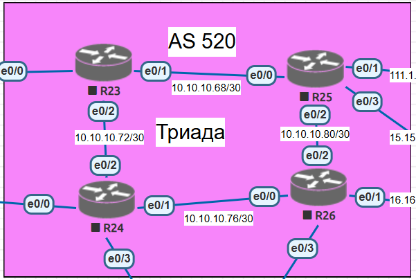
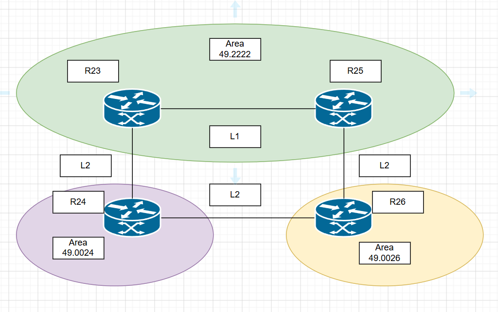

# IS-IS

## Цель:
Настроить IS-IS офисе Триада


## Описание/Пошаговая инструкция выполнения домашнего задания:
- Настроите IS-IS в ISP Триада.   
- R23 и R25 находятся в зоне 2222.
- R24 находится в зоне 24.
- R26 находится в зоне 26.

## Топология



## R23 и R25 находятся в зоне 2222.

Поднимаем процесс ISIS, по умолчанию маршрутизаторы поднимаются в L1-L2. L1 у нас внутри зоны и L2 в другие зоны. 

R23
```
R23(config)#router isis 1
R23(config-router)#net 49.2222.0000.0000.0000.0023.00
R23(config-router)#is-type level-1-2
R23(config-router)#
R23(config)#int e0/1
R23(config-if)#ip router isis 1
R23(config-if)#isis circuit-type level-1
R23(config-if)#int e0/2
R23(config-if)#ip router isis 1
R23(config-if)#isis circuit-type level-2
R23(config-if)#int lo0
R23(config-if)#isis circuit-type level-1-2
R23(config-if)#

```

R25
```
R25(config)#router isis 1
R25(config-router)#net 49.2222.0000.0000.0000.0025.00
R25(config-router)#is-type level-1-2
R25(config)#int lo0
R25(config-if)#ip router isis 1
R25(config-if)#isis circuit-type level-1-2
R25(config-if)#int e0/0
R25(config-if)#ip router isis 1
R25(config-if)#isis circuit-type level-1
R25(config-if)#int e0/2
R25(config-if)#ip router isis 1
R25(config-if)#isis circuit-type level-2


```

Cоседство и таблицf маршрутизации:
```
R25#sh isis neighbors

Tag 1:
System Id      Type Interface   IP Address      State Holdtime Circuit Id
R23            L1   Et0/0       10.10.10.69     UP    28       R25.01 
R25#
R25#sh ip route isis
Codes: L - local, C - connected, S - static, R - RIP, M - mobile, B - BGP
       D - EIGRP, EX - EIGRP external, O - OSPF, IA - OSPF inter area
       N1 - OSPF NSSA external type 1, N2 - OSPF NSSA external type 2
       E1 - OSPF external type 1, E2 - OSPF external type 2
       i - IS-IS, su - IS-IS summary, L1 - IS-IS level-1, L2 - IS-IS level-2
       ia - IS-IS inter area, * - candidate default, U - per-user static route
       o - ODR, P - periodic downloaded static route, H - NHRP, l - LISP
       a - application route
       + - replicated route, % - next hop override

Gateway of last resort is not set

      1.0.0.0/32 is subnetted, 3 subnets
i L1     1.1.1.23 [115/20] via 10.10.10.69, 00:01:54, Ethernet0/0
R25#
```
Соседство установилось, лупбэк соседа увидели через L1

##  R24 находится в зоне 24.

R24
```
R24(config)#router isis 1
R24(config-router)#net 49.0024.0000.0000.0000.0024.00
R24(config-router)#is-type level-2
R24(config-if)#int ra e0/1-2, lo0
R24(config-if-range)#ip router isis 1
R24(config-if-range)#isis circuit-type level-2

```
Соседство и таблица маршрутизации:
```
R24#sh isis neighbors

Tag 1:
System Id      Type Interface   IP Address      State Holdtime Circuit Id
R23            L2   Et0/2       10.10.10.73     UP    27       R24.02           
R24#sh ip route isis
Codes: L - local, C - connected, S - static, R - RIP, M - mobile, B - BGP
       D - EIGRP, EX - EIGRP external, O - OSPF, IA - OSPF inter area
       N1 - OSPF NSSA external type 1, N2 - OSPF NSSA external type 2
       E1 - OSPF external type 1, E2 - OSPF external type 2
       i - IS-IS, su - IS-IS summary, L1 - IS-IS level-1, L2 - IS-IS level-2
       ia - IS-IS inter area, * - candidate default, U - per-user static route
       o - ODR, P - periodic downloaded static route, H - NHRP, l - LISP
       a - application route
       + - replicated route, % - next hop override

Gateway of last resort is not set

      1.0.0.0/32 is subnetted, 3 subnets
i L2     1.1.1.23 [115/20] via 10.10.10.73, 00:01:36, Ethernet0/2
i L2     1.1.1.25 [115/30] via 10.10.10.73, 00:01:36, Ethernet0/2
      10.0.0.0/8 is variably subnetted, 5 subnets, 2 masks
i L2     10.10.10.68/30 [115/20] via 10.10.10.73, 00:01:36, Ethernet0/2
R24#
```
Установили соседство с R23. В таблице маршрутизации присутствуют маршруты L2, в том числе до Lo0 R25
```
R24#ping 1.1.1.25
Type escape sequence to abort.
Sending 5, 100-byte ICMP Echos to 1.1.1.25, timeout is 2 seconds:
!!!!!
Success rate is 100 percent (5/5), round-trip min/avg/max = 1/1/2 ms
R24#
```

## R26 находится в зоне 26.
R26
```
R26(config)#router isis 1
R26(config-router)#net 49.0026.0000.0000.0000.0026.00
R26(config-router)#is-type level-2
R26(config-router)#int ra e0/0, e0/2, lo0
R26(config-if-range)#ip router isis 1
R26(config-if-range)#isis circuit-type level-2
R26(config-if-range)#
```

Соседство и таблица маршрутизации:
```
R26#sh isis neighbors

Tag 1:
System Id      Type Interface   IP Address      State Holdtime Circuit Id
R24            L2   Et0/0       10.10.10.77     UP    28       R26.01           
R25            L2   Et0/2       10.10.10.81     UP    29       R26.02           

R26#sh ip route
Codes: L - local, C - connected, S - static, R - RIP, M - mobile, B - BGP
       D - EIGRP, EX - EIGRP external, O - OSPF, IA - OSPF inter area
       N1 - OSPF NSSA external type 1, N2 - OSPF NSSA external type 2
       E1 - OSPF external type 1, E2 - OSPF external type 2
       i - IS-IS, su - IS-IS summary, L1 - IS-IS level-1, L2 - IS-IS level-2
       ia - IS-IS inter area, * - candidate default, U - per-user static route
       o - ODR, P - periodic downloaded static route, H - NHRP, l - LISP
       a - application route
       + - replicated route, % - next hop override

Gateway of last resort is not set

      1.0.0.0/32 is subnetted, 4 subnets
i L2     1.1.1.23 [115/30] via 10.10.10.81, 00:05:56, Ethernet0/2
                  [115/30] via 10.10.10.77, 00:05:56, Ethernet0/0
i L2     1.1.1.24 [115/20] via 10.10.10.77, 00:05:56, Ethernet0/0
S        1.1.1.25 [1/0] via 10.10.10.81
C        1.1.1.26 is directly connected, Loopback0
      10.0.0.0/8 is variably subnetted, 6 subnets, 2 masks
i L2     10.10.10.68/30 [115/20] via 10.10.10.81, 00:06:15, Ethernet0/2
i L2     10.10.10.72/30 [115/20] via 10.10.10.77, 00:05:56, Ethernet0/0
C        10.10.10.76/30 is directly connected, Ethernet0/0
L        10.10.10.78/32 is directly connected, Ethernet0/0
C        10.10.10.80/30 is directly connected, Ethernet0/2
L        10.10.10.82/32 is directly connected, Ethernet0/2
      16.0.0.0/8 is variably subnetted, 2 subnets, 2 masks
C        16.16.16.0/30 is directly connected, Ethernet0/1
L        16.16.16.1/32 is directly connected, Ethernet0/1
      111.0.0.0/8 is variably subnetted, 2 subnets, 2 masks
C        111.111.1.0/30 is directly connected, Ethernet0/3
L        111.111.1.1/32 is directly connected, Ethernet0/3
S     192.168.50.0/24 [1/0] via 16.16.16.2
S     192.168.60.0/24 [1/0] via 16.16.16.2
R26#


R26#sh isis topology

Tag 1:

IS-IS TID 0 paths to level-2 routers
System Id            Metric     Next-Hop             Interface   SNPA
R23                  20         R24                  Et0/0       aabb.cc01.8010
R24                  10         R24                  Et0/0       aabb.cc01.8010
R25                  10         R25                  Et0/2       aabb.cc01.9020
R26                  --
R26#sh isis database


```

В таблице маршрутизации видим статику до 1.1.1.25, которую ставили при настройке PBR. Убираем.

```

R26(config)#no ip route 1.1.1.25 255.255.255.255 10.10.10.81
R26(config)#do sh ip route isis
Codes: L - local, C - connected, S - static, R - RIP, M - mobile, B - BGP
       D - EIGRP, EX - EIGRP external, O - OSPF, IA - OSPF inter area
       N1 - OSPF NSSA external type 1, N2 - OSPF NSSA external type 2
       E1 - OSPF external type 1, E2 - OSPF external type 2
       i - IS-IS, su - IS-IS summary, L1 - IS-IS level-1, L2 - IS-IS level-2
       ia - IS-IS inter area, * - candidate default, U - per-user static route
       o - ODR, P - periodic downloaded static route, H - NHRP, l - LISP
       a - application route
       + - replicated route, % - next hop override

Gateway of last resort is not set

      1.0.0.0/32 is subnetted, 4 subnets
i L2     1.1.1.23 [115/30] via 10.10.10.81, 00:09:52, Ethernet0/2
                  [115/30] via 10.10.10.77, 00:09:52, Ethernet0/0
i L2     1.1.1.24 [115/20] via 10.10.10.77, 00:09:52, Ethernet0/0
i L2     1.1.1.25 [115/20] via 10.10.10.81, 00:00:10, Ethernet0/2
      10.0.0.0/8 is variably subnetted, 6 subnets, 2 masks
i L2     10.10.10.68/30 [115/20] via 10.10.10.81, 00:10:11, Ethernet0/2
i L2     10.10.10.72/30 [115/20] via 10.10.10.77, 00:09:52, Ethernet0/0
R26(config)#
R26#ping 1.1.1.25
Type escape sequence to abort.
Sending 5, 100-byte ICMP Echos to 1.1.1.25, timeout is 2 seconds:
!!!!!
Success rate is 100 percent (5/5), round-trip min/avg/max = 1/1/2 ms
R26#ping 1.1.1.23
Type escape sequence to abort.
Sending 5, 100-byte ICMP Echos to 1.1.1.23, timeout is 2 seconds:
!!!!!
Success rate is 100 percent (5/5), round-trip min/avg/max = 1/1/2 ms
R26#ping 1.1.1.24
Type escape sequence to abort.
Sending 5, 100-byte ICMP Echos to 1.1.1.24, timeout is 2 seconds:
!!!!!
Success rate is 100 percent (5/5), round-trip min/avg/max = 1/7/17 ms
R26#

```
Готово
