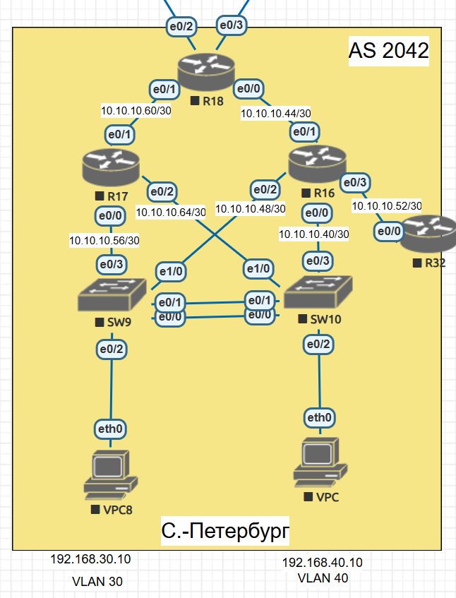

# EIGRP

## Цель:
Настроить EIGRP в С.-Петербург;
Использовать named EIGRP


## Описание/Пошаговая инструкция выполнения домашнего задания:
В офисе С.-Петербург настроить EIGRP.       
- R32 получает только маршрут по умолчанию.
- R16-17 анонсируют только суммарные префиксы.
- Использовать EIGRP named-mode для настройки сети.

## Топология




## Подготовка
Запустим процесс EIGRP и анонсируем  сети на всех L3 устройствах. Далее займемся суммаризацией, фильтрацией и выполним проверки.


</code></pre>
</details>
<details>
<summary>R16</summary>
<pre><code>
R16(config)#router eigrp SPB
R16(config-router)#address-family ipv4 unicast autonomous-system 1
R16(config-router-af)#eigrp router-id 16.16.16.16
R16(config-router-af)#net
R16(config-router-af)#network 10.10.10.44 0.0.0.3
R16(config-router-af)#network 10.10.10.44 0.0.0.3
*Nov 29 08:34:10.259: %DUAL-5-NBRCHANGE: EIGRP-IPv4 1: Neighbor 10.10.10.46 (Ethernet0/1) is up: new adjacency
R16(config-router-af)#network 10.10.10.48 0.0.0.3
R16(config-router-af)#network 10.10.10.40 0.0.0.3
R16(config-router-af)#network 10.10.10.52 0.0.0.3
R16(config-router-af)#network 1.1.1.16 0.0.0.0
R16(config-router-af)#


</code></pre>
</details>

</code></pre>
</details>
<details>
<summary>R17</summary>
<pre><code>
R17(config)#router eigrp SPB
R17(config-router)#address-family ipv4 unicast autonomous-system 1
R17(config-router-af)#eigrp router-id 17.17.17.17
R17(config-router-af)#network 10.10.10.60 0.0.0.3
R17(config-router-af)#network 10.10.10.56 0.0.0.3
R17(config-router-af)#network 10.10.10.64 0.0.0.3
R17(config-router-af)#network 1.1.1.17  0.0.0.0

</code></pre>
</details>

</code></pre>
</details>
<details>
<summary>R18</summary>
<pre><code>
R18(config)#router eigrp SPB
R18(config-router)#address-family ipv4 unicast autonomous-system 1
R18(config-router-af)#eigrp router-id 18.18.18.18
R18(config-router-af)#network 10.10.10.60 0.0.0.3
R18(config-router-af)#
*Nov 29 08:32:43.267: %DUAL-5-NBRCHANGE: EIGRP-IPv4 1: Neighbor 10.10.10.61 (Ethernet0/1) is up: new adjacency
R18(config-router-af)#network 10.10.10.44 0.0.0.3
R18(config-router-af)#network 1.1.1.18 0.0.0.0
</code></pre>
</details>

</code></pre>
</details>
<details>
<summary>R32</summary>
<pre><code>

R32(config)#router eigrp SPB
R32(config-router)#address-family ipv4 unicast autonomous-system 1
R32(config-router-af)#eigrp router-id 32.32.32.32
R32(config-router-af)#net
R32(config-router-af)#net
R32(config-router-af)#network 10.10.10.52 0.0.0.3
R32(config-router-af)#
*Nov 29 08:35:42.656: %DUAL-5-NBRCHANGE: EIGRP-IPv4 1: Neighbor 10.10.10.53 (Ethernet0/0) is up: new adjacency
R32(config-router-af)#network 1.1.1.32 0.0.0.0
R32(config-router-af)#

</code></pre>
</details>
Свитчи в L3, на них поднимаем EIGRP и анонсируем сети хостов VPC.

</code></pre>
</details>
<details>
<summary>SW9</summary>
<pre><code>
SW9(config)#router eigrp SPB
SW9(config-router)#address-family ipv4 unicast autonomous-system 1
SW9(config-router-af)#eigrp router-id 9.9.9.9
SW9(config-router-af)#network 10.10.10.56 0.0.0.3
SW9(config-router-af)#network 10.10.10.56 0.0.0.3
*Nov 29 08:36:49.302: %DUAL-5-NBRCHANGE: EIGRP-IPv4 1: Neighbor 10.10.10.57 (Ethernet0/3) is up: new adjacency
SW9(config-router-af)#network 10.10.10.48 0.0.0.3
SW9(config-router-af)#
*Nov 29 08:36:57.934: %DUAL-5-NBRCHANGE: EIGRP-IPv4 1: Neighbor 10.10.10.49 (Ethernet1/0) is up: new adjacency
SW9(config-router-af)#network 192.168.30.0 0.0.0.255
SW9(config-router-af)#network 192.168.40.0 0.0.0.255
SW9(config-router-af)#

</code></pre>
</details>

</code></pre>
</details>
<details>
<summary>SW10</summary>
<pre><code>
SW10(config)#router eigrp SPB
SW10(config-router)#address-family ipv4 unicast autonomous-system 1
SW10(config-router-af)#eigrp router-id 10.10.10.10
SW10(config-router-af)#network 10.10.10.40 0.0.0.3
SW10(config-router-af)#network 10.10.10.40 0.0.0.3
*Nov 29 08:38:46.670: %DUAL-5-NBRCHANGE: EIGRP-IPv4 1: Neighbor 10.10.10.41 (Ethernet0/3) is up: new adjacency
SW10(config-router-af)#network 10.10.10.64 0.0.0.3
SW10(config-router-af)#
*Nov 29 08:38:56.416: %DUAL-5-NBRCHANGE: EIGRP-IPv4 1: Neighbor 10.10.10.65 (Ethernet1/0) is up: new adjacency
SW10(config-router-af)#network 1.1.1.10 0.0.0.0
SW10(config-router-af)#network 192.168.30.0 0.0.0.255
SW10(config-router-af)#network 192.168.30.0 0.0.0.255
*Nov 29 08:39:26.751: %DUAL-5-NBRCHANGE: EIGRP-IPv4 1: Neighbor 192.168.30.2 (Vlan30) is up: new adjacency
SW10(config-router-af)#network 192.168.40.0 0.0.0.255
SW10(config-router-af)#
*Nov 29 08:39:31.878: %DUAL-5-NBRCHANGE: EIGRP-IPv4 1: Neighbor 192.168.40.2 (Vlan40) is up: new adjacency
SW10(config-router-af)#

</code></pre>
</details>

Соседство:
```
R17#sh ip eigrp neighbors
EIGRP-IPv4 VR(SPB) Address-Family Neighbors for AS(1)
H   Address                 Interface              Hold Uptime   SRTT   RTO  Q  Seq
                                                   (sec)         (ms)       Cnt Num
2   10.10.10.66             Et0/2                    10 00:02:37    5   100  0  23
1   10.10.10.58             Et0/0                    11 00:04:45    5   100  0  24
0   10.10.10.62             Et0/1                    13 00:08:51    5   100  0  22
R17#

```

```
R16#sh ip eigrp nei
EIGRP-IPv4 VR(SPB) Address-Family Neighbors for AS(1)
H   Address                 Interface              Hold Uptime   SRTT   RTO  Q  Seq
                                                   (sec)         (ms)       Cnt Num
3   10.10.10.42             Et0/0                    11 00:03:37    3   100  0  24
2   10.10.10.50             Et0/2                    14 00:05:26    3   100  0  23
1   10.10.10.54             Et0/3                    10 00:06:41    5   100  0  9
0   10.10.10.46             Et0/1                    13 00:08:14   89   534  0  23
R16#
```

Соседство установилось. Таблица маршрутизации:
```
R16#sh ip route eigrp
Codes: L - local, C - connected, S - static, R - RIP, M - mobile, B - BGP
       D - EIGRP, EX - EIGRP external, O - OSPF, IA - OSPF inter area
       N1 - OSPF NSSA external type 1, N2 - OSPF NSSA external type 2
       E1 - OSPF external type 1, E2 - OSPF external type 2
       i - IS-IS, su - IS-IS summary, L1 - IS-IS level-1, L2 - IS-IS level-2
       ia - IS-IS inter area, * - candidate default, U - per-user static route
       o - ODR, P - periodic downloaded static route, H - NHRP, l - LISP
       a - application route
       + - replicated route, % - next hop override

Gateway of last resort is not set

      1.0.0.0/32 is subnetted, 5 subnets
D        1.1.1.10 [90/1024640] via 10.10.10.42, 00:04:33, Ethernet0/0
D        1.1.1.17 [90/1536640] via 10.10.10.50, 00:05:03, Ethernet0/2
                  [90/1536640] via 10.10.10.46, 00:05:03, Ethernet0/1
                  [90/1536640] via 10.10.10.42, 00:05:03, Ethernet0/0
D        1.1.1.18 [90/1024640] via 10.10.10.46, 00:06:59, Ethernet0/1
D        1.1.1.32 [90/1024640] via 10.10.10.54, 00:06:59, Ethernet0/3
      10.0.0.0/8 is variably subnetted, 11 subnets, 2 masks
D        10.10.10.56/30 [90/1536000] via 10.10.10.50, 00:04:33, Ethernet0/2
D        10.10.10.60/30 [90/1536000] via 10.10.10.46, 00:05:03, Ethernet0/1
D        10.10.10.64/30 [90/1536000] via 10.10.10.42, 00:04:33, Ethernet0/0
D     192.168.30.0/24 [90/1029120] via 10.10.10.50, 00:04:35, Ethernet0/2
                      [90/1029120] via 10.10.10.42, 00:04:35, Ethernet0/0
D     192.168.40.0/24 [90/1029120] via 10.10.10.50, 00:04:30, Ethernet0/2
                      [90/1029120] via 10.10.10.42, 00:04:30, Ethernet0/0
R16#

R16#ping 192.168.30.10
Type escape sequence to abort.
Sending 5, 100-byte ICMP Echos to 192.168.30.10, timeout is 2 seconds:
.!!!!
Success rate is 80 percent (4/5), round-trip min/avg/max = 1/1/2 ms
R16#
```
```
VPCS : 192.168.40.10 255.255.255.0 gateway 192.168.40.1

VPCS> ping 1.1.1.32

84 bytes from 1.1.1.32 icmp_seq=1 ttl=253 time=1.238 ms
84 bytes from 1.1.1.32 icmp_seq=2 ttl=253 time=1.009 ms
84 bytes from 1.1.1.32 icmp_seq=3 ttl=253 time=0.794 ms
84 bytes from 1.1.1.32 icmp_seq=4 ttl=253 time=0.979 ms
84 bytes from 1.1.1.32 icmp_seq=5 ttl=253 time=1.040 ms

VPCS> trace 1.1.1.32
trace to 1.1.1.32, 8 hops max, press Ctrl+C to stop
 1   192.168.40.3   0.234 ms  0.147 ms  0.131 ms
 2   10.10.10.41   0.432 ms  0.349 ms  0.388 ms
 3   *10.10.10.54   0.698 ms (ICMP type:3, code:3, Destination port unreachable)  *

VPCS>
```

## R32 получает только маршрут по умолчанию.

</code></pre>
</details>
<details>
<summary> R32 Маршруты ДО фильтрации</summary>
<pre><code>
R32#sh ip route
Codes: L - local, C - connected, S - static, R - RIP, M - mobile, B - BGP
       D - EIGRP, EX - EIGRP external, O - OSPF, IA - OSPF inter area
       N1 - OSPF NSSA external type 1, N2 - OSPF NSSA external type 2
       E1 - OSPF external type 1, E2 - OSPF external type 2
       i - IS-IS, su - IS-IS summary, L1 - IS-IS level-1, L2 - IS-IS level-2
       ia - IS-IS inter area, * - candidate default, U - per-user static route
       o - ODR, P - periodic downloaded static route, H - NHRP, l - LISP
       a - application route
       + - replicated route, % - next hop override

Gateway of last resort is not set

      1.0.0.0/32 is subnetted, 5 subnets
D        1.1.1.10 [90/1536640] via 10.10.10.53, 00:10:40, Ethernet0/0
D        1.1.1.16 [90/1024640] via 10.10.10.53, 00:14:06, Ethernet0/0
D        1.1.1.17 [90/2048640] via 10.10.10.53, 00:14:06, Ethernet0/0
D        1.1.1.18 [90/1536640] via 10.10.10.53, 00:14:06, Ethernet0/0
C        1.1.1.32 is directly connected, Loopback0
      10.0.0.0/8 is variably subnetted, 8 subnets, 2 masks
D        10.10.10.40/30 [90/1536000] via 10.10.10.53, 00:14:06, Ethernet0/0
D        10.10.10.44/30 [90/1536000] via 10.10.10.53, 00:14:06, Ethernet0/0
D        10.10.10.48/30 [90/1536000] via 10.10.10.53, 00:14:06, Ethernet0/0
C        10.10.10.52/30 is directly connected, Ethernet0/0
L        10.10.10.54/32 is directly connected, Ethernet0/0
D        10.10.10.56/30 [90/2048000] via 10.10.10.53, 00:12:51, Ethernet0/0
D        10.10.10.60/30 [90/2048000] via 10.10.10.53, 00:14:06, Ethernet0/0
D        10.10.10.64/30 [90/2048000] via 10.10.10.53, 00:10:55, Ethernet0/0
D     192.168.30.0/24 [90/1541120] via 10.10.10.53, 00:10:24, Ethernet0/0
D     192.168.40.0/24 [90/1541120] via 10.10.10.53, 00:10:19, Ethernet0/0
R32#
</code></pre>
</details>

Прописываем статикой маршрут по умолчанию на R18 и сделаем его редистрибьюцию:
```
R18(config)#ip route 0.0.0.0 0.0.0.0 111.111.111.1

R18(config)#router eigrp SPB
R18(config-router)#address-family ipv4 unicast autonomous-system 1
R18(config-router-af)#topology base
R18(config-router-af-topology)#redistribute static

```
На R16 пишем префикс лист, разрешающий передачу только маршрута по умолчанию и применяем на интерфейс в сторону R32
```

R16(config)#ip prefix-list DGW seq 100 permit 0.0.0.0/0
R16(config)#router eigrp SPB
R16(config-router)# address-family ipv4 unicast autonomous-system 1
R16(config-router-af)#topology base
R16(config-router-af-topology)#distribute-list prefix DGW out e0/3
R16(config-router-af-topology)#

```
</code></pre>
</details>
<details>
<summary> R32 Маршруты ПОСЛЕ фильтрации</summary>
<pre><code>

R32#sh ip route
Codes: L - local, C - connected, S - static, R - RIP, M - mobile, B - BGP
       D - EIGRP, EX - EIGRP external, O - OSPF, IA - OSPF inter area
       N1 - OSPF NSSA external type 1, N2 - OSPF NSSA external type 2
       E1 - OSPF external type 1, E2 - OSPF external type 2
       i - IS-IS, su - IS-IS summary, L1 - IS-IS level-1, L2 - IS-IS level-2
       ia - IS-IS inter area, * - candidate default, U - per-user static route
       o - ODR, P - periodic downloaded static route, H - NHRP, l - LISP
       a - application route
       + - replicated route, % - next hop override

Gateway of last resort is 10.10.10.53 to network 0.0.0.0

D*EX  0.0.0.0/0 [170/2048000] via 10.10.10.53, 00:16:03, Ethernet0/0
      1.0.0.0/32 is subnetted, 1 subnets
C        1.1.1.32 is directly connected, Loopback0
      10.0.0.0/8 is variably subnetted, 2 subnets, 2 masks
C        10.10.10.52/30 is directly connected, Ethernet0/0
L        10.10.10.54/32 is directly connected, Ethernet0/0
R32#

</code></pre>
</details>

## R16-17 анонсируют только суммарные префиксы.

Анонсируемые сети:
```
R16#sh run | sec eig
router eigrp SPB
 !
 address-family ipv4 unicast autonomous-system 1
  !
  topology base
   distribute-list prefix DGW out Ethernet0/3
  exit-af-topology
  network 1.1.1.16 0.0.0.0
  network 10.10.10.40 0.0.0.3
  network 10.10.10.44 0.0.0.3
  network 10.10.10.48 0.0.0.3
  network 10.10.10.52 0.0.0.3
  eigrp router-id 16.16.16.16
 exit-address-family

```

```
R17#sh run | sec eig
router eigrp SPB
 !
 address-family ipv4 unicast autonomous-system 1
  !
  topology base
  exit-af-topology
  network 1.1.1.17 0.0.0.0
  network 10.10.10.56 0.0.0.3
  network 10.10.10.60 0.0.0.3
  network 10.10.10.64 0.0.0.3
  eigrp router-id 17.17.17.17
 exit-address-family
R17#

```
Сделаем суммаризацию до 10.10.10.32/27

```
R16(config)#router eigrp SPB
R16(config-router)# !
R16(config-router)# address-family ipv4 unicast autonomous-system 1
R16(config-router-af)#af-in
R16(config-router-af)#af-interface e0/0
R16(config-router-af-interface)#summ
R16(config-router-af-interface)#summary-address 10.10.10.32 255.255.255.224
R16(config-router-af-interface)#af-interface e0/0
*Nov 29 09:52:47.907: %DUAL-5-NBRCHANGE: EIGRP-IPv4 1: Neighbor 10.10.10.42 (Ethernet0/0) is resync: summary configured
R16(config-router-af-interface)#af-interface e0/1
R16(config-router-af-interface)#summary-address 10.10.10.32 255.255.255.224
R16(config-router-af-interface)#af-interface e0/
*Nov 29 09:52:53.945: %DUAL-5-NBRCHANGE: EIGRP-IPv4 1: Neighbor 10.10.10.46 (Ethernet0/1) is resync: summary configured
R16(config-router-af-interface)#af-interface e0/2
R16(config-router-af-interface)#summary-address 10.10.10.32 255.255.255.224
R16(config-router-af-interface)#
*Nov 29 09:52:58.973: %DUAL-5-NBRCHANGE: EIGRP-IPv4 1: Neighbor 10.10.10.50 (Ethernet0/2) is resync: summary configured
R16(config-router-af-interface)#

```

```
R17(config)#router eigrp SPB
R17(config-router)# !
R17(config-router)# address-family ipv4 unicast autonomous-system 1
R17(config-router-af)#  !
R17(config-router-af)#af-in
R17(config-router-af)#af-interface e 0/0
R17(config-router-af-interface)#summary-address 10.10.10.32 255.255.255.224
R17(config-router-af-interface)#summary-address 10.10.10.32 255.255.255.224
*Nov 29 09:54:30.724: %DUAL-5-NBRCHANGE: EIGRP-IPv4 1: Neighbor 10.10.10.58 (Ethernet0/0) is resync: summary configured
R17(config-router-af-interface)#af-interface e 0/1
R17(config-router-af-interface)#summary-address 10.10.10.32 255.255.255.224
R17(config-router-af-interface)#af-interface e 0/1
*Nov 29 09:54:37.987: %DUAL-5-NBRCHANGE: EIGRP-IPv4 1: Neighbor 10.10.10.62 (Ethernet0/1) is resync: summary configured
R17(config-router-af-interface)#af-interface e 0/2
R17(config-router-af-interface)#summary-address 10.10.10.32 255.255.255.224
R17(config-router-af-interface)#
*Nov 29 09:54:42.677: %DUAL-5-NBRCHANGE: EIGRP-IPv4 1: Neighbor 10.10.10.66 (Ethernet0/2) is resync: summary configured
R17(config-router-af-interface)#

```


Выводы sh ip route eigrp:

</code></pre>
</details>
<details>
<summary>R16</summary>
<pre><code>
D*EX  0.0.0.0/0 [170/1536000] via 10.10.10.46, 00:30:53, Ethernet0/1
      1.0.0.0/32 is subnetted, 6 subnets
D        1.1.1.9 [90/1024640] via 10.10.10.50, 01:03:47, Ethernet0/2
D        1.1.1.10 [90/1024640] via 10.10.10.42, 01:16:06, Ethernet0/0
D        1.1.1.17 [90/1536640] via 10.10.10.50, 01:16:36, Ethernet0/2
                  [90/1536640] via 10.10.10.46, 01:16:36, Ethernet0/1
                  [90/1536640] via 10.10.10.42, 01:16:36, Ethernet0/0
D        1.1.1.18 [90/1024640] via 10.10.10.46, 01:18:32, Ethernet0/1
D        1.1.1.32 [90/1024640] via 10.10.10.54, 01:18:32, Ethernet0/3
      10.0.0.0/8 is variably subnetted, 12 subnets, 3 masks
D        10.10.10.32/27 is a summary, 00:02:47, Null0
D        10.10.10.56/30 [90/1536000] via 10.10.10.50, 01:16:06, Ethernet0/2
D        10.10.10.60/30 [90/1536000] via 10.10.10.46, 00:01:04, Ethernet0/1
D        10.10.10.64/30 [90/1536000] via 10.10.10.42, 01:16:06, Ethernet0/0
D     192.168.30.0/24 [90/1029120] via 10.10.10.50, 01:16:08, Ethernet0/2
                      [90/1029120] via 10.10.10.42, 01:16:08, Ethernet0/0
D     192.168.40.0/24 [90/1029120] via 10.10.10.50, 01:16:03, Ethernet0/2
                      [90/1029120] via 10.10.10.42, 01:16:03, Ethernet0/0
R16#

</code></pre>
</details>
</code></pre>
</details>
<details>
<summary>R17</summary>
<pre><code>

D*EX  0.0.0.0/0 [170/1536000] via 10.10.10.62, 00:32:14, Ethernet0/1
      1.0.0.0/32 is subnetted, 6 subnets
D        1.1.1.9 [90/1024640] via 10.10.10.58, 01:05:07, Ethernet0/0
D        1.1.1.10 [90/1024640] via 10.10.10.66, 01:17:27, Ethernet0/2
D        1.1.1.16 [90/1536640] via 10.10.10.66, 01:17:57, Ethernet0/2
                  [90/1536640] via 10.10.10.62, 01:17:57, Ethernet0/1
                  [90/1536640] via 10.10.10.58, 01:17:57, Ethernet0/0
D        1.1.1.18 [90/1024640] via 10.10.10.62, 01:17:54, Ethernet0/1
D        1.1.1.32 [90/2048640] via 10.10.10.66, 01:17:57, Ethernet0/2
                  [90/2048640] via 10.10.10.62, 01:17:57, Ethernet0/1
                  [90/2048640] via 10.10.10.58, 01:17:57, Ethernet0/0
      10.0.0.0/8 is variably subnetted, 10 subnets, 3 masks
D        10.10.10.32/27 is a summary, 00:02:13, Null0
D        10.10.10.40/30 [90/1536000] via 10.10.10.66, 01:17:27, Ethernet0/2
D        10.10.10.44/30 [90/1536000] via 10.10.10.62, 00:02:24, Ethernet0/1
D        10.10.10.48/30 [90/1536000] via 10.10.10.58, 01:17:27, Ethernet0/0
D     192.168.30.0/24 [90/1029120] via 10.10.10.66, 01:17:29, Ethernet0/2
                      [90/1029120] via 10.10.10.58, 01:17:29, Ethernet0/0
D     192.168.40.0/24 [90/1029120] via 10.10.10.66, 01:17:23, Ethernet0/2
                      [90/1029120] via 10.10.10.58, 01:17:23, Ethernet0/0

</code></pre>
</details>

</code></pre>
</details>
<details>
<summary>R18</summary>
<pre><code>

Gateway of last resort is 111.111.111.1 to network 0.0.0.0

      1.0.0.0/32 is subnetted, 6 subnets
D        1.1.1.9 [90/1536640] via 10.10.10.61, 01:05:54, Ethernet0/1
                 [90/1536640] via 10.10.10.45, 01:05:54, Ethernet0/0
D        1.1.1.10 [90/1536640] via 10.10.10.61, 01:18:31, Ethernet0/1
                  [90/1536640] via 10.10.10.45, 01:18:31, Ethernet0/0
D        1.1.1.16 [90/1024640] via 10.10.10.45, 01:22:54, Ethernet0/0
D        1.1.1.17 [90/1024640] via 10.10.10.61, 01:24:57, Ethernet0/1
D        1.1.1.32 [90/1536640] via 10.10.10.45, 01:21:49, Ethernet0/0
      10.0.0.0/8 is variably subnetted, 6 subnets, 3 masks
D        10.10.10.32/27 [90/1536000] via 10.10.10.61, 00:03:04, Ethernet0/1
                        [90/1536000] via 10.10.10.45, 00:03:04, Ethernet0/0
D        10.10.10.64/30 [90/1536000] via 10.10.10.61, 01:18:46, Ethernet0/1
D     192.168.30.0/24 [90/1541120] via 10.10.10.61, 01:18:15, Ethernet0/1
                      [90/1541120] via 10.10.10.45, 01:18:15, Ethernet0/0
D     192.168.40.0/24 [90/1541120] via 10.10.10.61, 01:18:10, Ethernet0/1
                      [90/1541120] via 10.10.10.45, 01:18:10, Ethernet0/0


</code></pre>
</details>

</code></pre>
</details>
<details>
<summary>R32</summary>
<pre><code>
D*EX  0.0.0.0/0 [170/2048000] via 10.10.10.53, 00:34:02, Ethernet0/0
      1.0.0.0/32 is subnetted, 1 subnets
C        1.1.1.32 is directly connected, Loopback0
      10.0.0.0/8 is variably subnetted, 2 subnets, 2 masks
C        10.10.10.52/30 is directly connected, Ethernet0/0
L        10.10.10.54/32 is directly connected, Ethernet0/0


</code></pre>
</details>

</code></pre>
</details>
<details>
<summary>SW9</summary>
<pre><code>

Gateway of last resort is 10.10.10.57 to network 0.0.0.0

D*EX  0.0.0.0/0 [170/2048000] via 10.10.10.57, 00:34:46, Ethernet0/3
                [170/2048000] via 10.10.10.49, 00:34:46, Ethernet1/0
      1.0.0.0/32 is subnetted, 6 subnets
D        1.1.1.10 [90/10880] via 192.168.40.3, 01:19:53, Vlan40
                  [90/10880] via 192.168.30.3, 01:19:53, Vlan30
D        1.1.1.16 [90/1024640] via 10.10.10.49, 01:19:53, Ethernet1/0
D        1.1.1.17 [90/1024640] via 10.10.10.57, 01:19:53, Ethernet0/3
D        1.1.1.18 [90/1536640] via 10.10.10.57, 01:19:53, Ethernet0/3
                  [90/1536640] via 10.10.10.49, 01:19:53, Ethernet1/0
D        1.1.1.32 [90/1536640] via 10.10.10.49, 01:19:53, Ethernet1/0
      10.0.0.0/8 is variably subnetted, 7 subnets, 3 masks
D        10.10.10.32/27 [90/1536000] via 10.10.10.57, 00:04:56, Ethernet0/3
                        [90/1536000] via 10.10.10.49, 00:04:56, Ethernet1/0
D        10.10.10.40/30 [90/1029120] via 192.168.40.3, 00:04:56, Vlan40
                        [90/1029120] via 192.168.30.3, 00:04:56, Vlan30
D        10.10.10.64/30 [90/1029120] via 192.168.40.3, 01:19:53, Vlan40
                        [90/1029120] via 192.168.30.3, 01:19:53, Vlan30

</code></pre>
</details>

</code></pre>
</details>
<details>
<summary>SW10</summary>
<pre><code>

Gateway of last resort is 10.10.10.65 to network 0.0.0.0

D*EX  0.0.0.0/0 [170/2048000] via 10.10.10.65, 00:35:20, Ethernet1/0
                [170/2048000] via 10.10.10.41, 00:35:20, Ethernet0/3
      1.0.0.0/32 is subnetted, 6 subnets
D        1.1.1.9 [90/10880] via 192.168.40.2, 01:08:14, Vlan40
                 [90/10880] via 192.168.30.2, 01:08:14, Vlan30
D        1.1.1.16 [90/1024640] via 10.10.10.41, 01:20:28, Ethernet0/3
D        1.1.1.17 [90/1024640] via 10.10.10.65, 01:20:28, Ethernet1/0
D        1.1.1.18 [90/1536640] via 10.10.10.65, 01:20:28, Ethernet1/0
                  [90/1536640] via 10.10.10.41, 01:20:28, Ethernet0/3
D        1.1.1.32 [90/1536640] via 10.10.10.41, 01:20:28, Ethernet0/3
      10.0.0.0/8 is variably subnetted, 7 subnets, 3 masks
D        10.10.10.32/27 [90/1536000] via 10.10.10.65, 00:05:19, Ethernet1/0
                        [90/1536000] via 10.10.10.41, 00:05:19, Ethernet0/3
D        10.10.10.48/30 [90/1029120] via 192.168.40.2, 00:05:19, Vlan40
                        [90/1029120] via 192.168.30.2, 00:05:19, Vlan30
D        10.10.10.56/30 [90/1029120] via 192.168.40.2, 00:05:19, Vlan40
                        [90/1029120] via 192.168.30.2, 00:05:19, Vlan30


</code></pre>
</details>

Проверим доступность всех устройств с VPC:
```
VPCS> sh ip

NAME        : VPCS[1]
IP/MASK     : 192.168.40.10/24
GATEWAY     : 192.168.40.1
DNS         :
MAC         : 00:50:79:66:68:0b
LPORT       : 20000
RHOST:PORT  : 127.0.0.1:30000
MTU         : 1500

VPCS> ping 1.1.1.32

84 bytes from 1.1.1.32 icmp_seq=1 ttl=253 time=0.781 ms
84 bytes from 1.1.1.32 icmp_seq=2 ttl=253 time=0.777 ms
^C
VPCS> ping 1.1.1.18

84 bytes from 1.1.1.18 icmp_seq=1 ttl=253 time=0.898 ms
84 bytes from 1.1.1.18 icmp_seq=2 ttl=253 time=1.013 ms
^C
VPCS> ping 1.1.1.17

84 bytes from 1.1.1.17 icmp_seq=1 ttl=254 time=0.659 ms
84 bytes from 1.1.1.17 icmp_seq=2 ttl=254 time=0.921 ms
^C
VPCS> ping 1.1.1.16

84 bytes from 1.1.1.16 icmp_seq=1 ttl=254 time=0.852 ms
84 bytes from 1.1.1.16 icmp_seq=2 ttl=254 time=1.047 ms
^C
VPCS> ping 1.1.1.10

84 bytes from 1.1.1.10 icmp_seq=1 ttl=255 time=0.493 ms
84 bytes from 1.1.1.10 icmp_seq=2 ttl=255 time=0.450 ms
^C
VPCS> ping 1.1.1.9

84 bytes from 1.1.1.9 icmp_seq=1 ttl=255 time=0.716 ms
84 bytes from 1.1.1.9 icmp_seq=2 ttl=255 time=0.766 ms
^C
VPCS>
```
