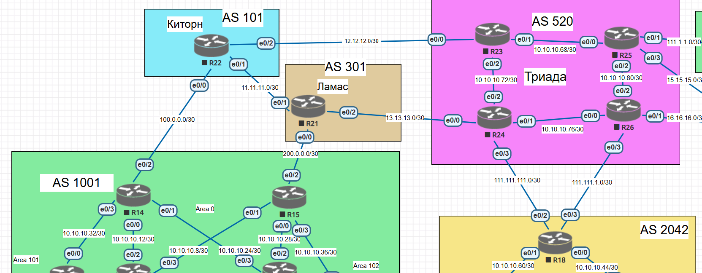

# BGP. Основы

## Цель
Настроить BGP между автономными системами       
Организовать доступность между офисами Москва и С.-Петербург


Описание/Пошаговая инструкция выполнения домашнего задания:     


- Настроите eBGP между офисом Москва и двумя провайдерами - Киторн и Ламас.       
- Настроите eBGP между провайдерами Киторн и Ламас.       
- Настроите eBGP между Ламас и Триада.        
- Настроите eBGP между офисом С.-Петербург и провайдером Триада.      
- Организуете IP доступность между пограничным роутерами офисами Москва и С.-Петербург.       

## Топология 




## Конфиги 

R14
```
R14#sh run | sec bgp
router bgp 1001
 bgp router-id 14.14.14.14
 bgp log-neighbor-changes
 network 1.1.1.14 mask 255.255.255.255
 neighbor 100.0.0.1 remote-as 101

```

R15
```
R15#sh run | sec bgp
router bgp 1001
 bgp router-id 15.15.15.15
 bgp log-neighbor-changes
 network 1.1.1.15 mask 255.255.255.255
 neighbor 200.0.0.1 remote-as 301

```

R21
```
R21#sh run | sec bgp
router bgp 301
 bgp router-id 21.21.21.21
 bgp log-neighbor-changes
 network 1.1.1.21 mask 255.255.255.255
 neighbor 11.11.11.1 remote-as 101
 neighbor 13.13.13.2 remote-as 520
 neighbor 200.0.0.2 remote-as 1001
R21#

```

R22
```
R22#sh run | sec bgp
router bgp 101
 bgp router-id 22.22.22.22
 bgp log-neighbor-changes
 network 1.1.1.22 mask 255.255.255.255
 neighbor 11.11.11.2 remote-as 301
 neighbor 100.0.0.2 remote-as 1001

```

R24
```
R24#sh run | sec bgp
router bgp 520
 bgp router-id 24.24.24.24
 bgp log-neighbor-changes
 network 1.1.1.24 mask 255.255.255.255
 neighbor 13.13.13.1 remote-as 301
 neighbor 111.111.111.2 remote-as 2042

```

R18
```
R18#sh run | sec bgp
router bgp 2042
 bgp router-id 18.18.18.18
 bgp log-neighbor-changes
 network 1.1.1.18 mask 255.255.255.255
 neighbor 111.111.111.1 remote-as 520

```


## Организуете IP доступность между пограничным роутерами офисами Москва и С.-Петербург.      

R14
```
R14#sh run | sec bgp
router bgp 1001
 bgp router-id 14.14.14.14
 bgp log-neighbor-changes
 network 1.1.1.14 mask 255.255.255.255
 neighbor 100.0.0.1 remote-as 101
R14#
R14#sh ip route bgp
Codes: L - local, C - connected, S - static, R - RIP, M - mobile, B - BGP
       D - EIGRP, EX - EIGRP external, O - OSPF, IA - OSPF inter area
       N1 - OSPF NSSA external type 1, N2 - OSPF NSSA external type 2
       E1 - OSPF external type 1, E2 - OSPF external type 2
       i - IS-IS, su - IS-IS summary, L1 - IS-IS level-1, L2 - IS-IS level-2
       ia - IS-IS inter area, * - candidate default, U - per-user static route
       o - ODR, P - periodic downloaded static route, H - NHRP, l - LISP
       a - application route
       + - replicated route, % - next hop override

Gateway of last resort is 100.0.0.1 to network 0.0.0.0

      1.0.0.0/32 is subnetted, 5 subnets
B        1.1.1.18 [20/0] via 100.0.0.1, 00:23:04
B        1.1.1.21 [20/0] via 100.0.0.1, 00:37:00
B        1.1.1.22 [20/0] via 100.0.0.1, 00:41:12
B        1.1.1.24 [20/0] via 100.0.0.1, 00:30:11
R14#sh ip bgp sum
BGP router identifier 14.14.14.14, local AS number 1001
BGP table version is 8, main routing table version 8
5 network entries using 700 bytes of memory
5 path entries using 400 bytes of memory
5/5 BGP path/bestpath attribute entries using 720 bytes of memory
4 BGP AS-PATH entries using 112 bytes of memory
0 BGP route-map cache entries using 0 bytes of memory
0 BGP filter-list cache entries using 0 bytes of memory
BGP using 1932 total bytes of memory
BGP activity 7/2 prefixes, 8/3 paths, scan interval 60 secs

Neighbor        V           AS MsgRcvd MsgSent   TblVer  InQ OutQ Up/Down  State/PfxRcd
100.0.0.1       4          101      52      50        8    0    0 00:41:58        4
R14#ping 1.1.1.15 source 1.1.1.14
Type escape sequence to abort.
Sending 5, 100-byte ICMP Echos to 1.1.1.15, timeout is 2 seconds:
Packet sent with a source address of 1.1.1.14
!!!!!
Success rate is 100 percent (5/5), round-trip min/avg/max = 1/1/2 ms
R14#ping 1.1.1.18 source 1.1.1.14
Type escape sequence to abort.
Sending 5, 100-byte ICMP Echos to 1.1.1.18, timeout is 2 seconds:
Packet sent with a source address of 1.1.1.14
!!!!!
Success rate is 100 percent (5/5), round-trip min/avg/max = 1/1/2 ms
R14#

```

R15
```
R15#sh run | sec bgp
router bgp 1001
 bgp router-id 15.15.15.15
 bgp log-neighbor-changes
 network 1.1.1.15 mask 255.255.255.255
 neighbor 200.0.0.1 remote-as 301
R15#
R15#sh ip route bgp
Codes: L - local, C - connected, S - static, R - RIP, M - mobile, B - BGP
       D - EIGRP, EX - EIGRP external, O - OSPF, IA - OSPF inter area
       N1 - OSPF NSSA external type 1, N2 - OSPF NSSA external type 2
       E1 - OSPF external type 1, E2 - OSPF external type 2
       i - IS-IS, su - IS-IS summary, L1 - IS-IS level-1, L2 - IS-IS level-2
       ia - IS-IS inter area, * - candidate default, U - per-user static route
       o - ODR, P - periodic downloaded static route, H - NHRP, l - LISP
       a - application route
       + - replicated route, % - next hop override

Gateway of last resort is 200.0.0.1 to network 0.0.0.0

      1.0.0.0/32 is subnetted, 5 subnets
B        1.1.1.18 [20/0] via 200.0.0.1, 00:24:43
B        1.1.1.21 [20/0] via 200.0.0.1, 00:45:50
B        1.1.1.22 [20/0] via 200.0.0.1, 00:38:38
B        1.1.1.24 [20/0] via 200.0.0.1, 00:31:50
R15#ping 1.1.1.14 source 1.1.1.15
Type escape sequence to abort.
Sending 5, 100-byte ICMP Echos to 1.1.1.14, timeout is 2 seconds:
Packet sent with a source address of 1.1.1.15
!!!!!
Success rate is 100 percent (5/5), round-trip min/avg/max = 1/1/1 ms
R15#ping 1.1.1.18 source 1.1.1.15
Type escape sequence to abort.
Sending 5, 100-byte ICMP Echos to 1.1.1.18, timeout is 2 seconds:
Packet sent with a source address of 1.1.1.15
!!!!!
Success rate is 100 percent (5/5), round-trip min/avg/max = 1/1/3 ms
R15#

```

R18
```
R18#sh ip route bgp
Codes: L - local, C - connected, S - static, R - RIP, M - mobile, B - BGP
       D - EIGRP, EX - EIGRP external, O - OSPF, IA - OSPF inter area
       N1 - OSPF NSSA external type 1, N2 - OSPF NSSA external type 2
       E1 - OSPF external type 1, E2 - OSPF external type 2
       i - IS-IS, su - IS-IS summary, L1 - IS-IS level-1, L2 - IS-IS level-2
       ia - IS-IS inter area, * - candidate default, U - per-user static route
       o - ODR, P - periodic downloaded static route, H - NHRP, l - LISP
       a - application route
       + - replicated route, % - next hop override

Gateway of last resort is 111.111.111.1 to network 0.0.0.0

      1.0.0.0/32 is subnetted, 6 subnets
B        1.1.1.14 [20/0] via 111.111.111.1, 00:25:26
B        1.1.1.15 [20/0] via 111.111.111.1, 00:25:26
B        1.1.1.21 [20/0] via 111.111.111.1, 00:25:26
B        1.1.1.22 [20/0] via 111.111.111.1, 00:25:26
B        1.1.1.24 [20/0] via 111.111.111.1, 00:25:26
R18#ping 1.1.1.14 source 1.1.1.18
Type escape sequence to abort.
Sending 5, 100-byte ICMP Echos to 1.1.1.14, timeout is 2 seconds:
Packet sent with a source address of 1.1.1.18
!!!!!
Success rate is 100 percent (5/5), round-trip min/avg/max = 2/2/2 ms
R18#ping 1.1.1.15 source 1.1.1.18
Type escape sequence to abort.
Sending 5, 100-byte ICMP Echos to 1.1.1.15, timeout is 2 seconds:
Packet sent with a source address of 1.1.1.18
!!!!!
Success rate is 100 percent (5/5), round-trip min/avg/max = 1/1/2 ms
R18#

```
