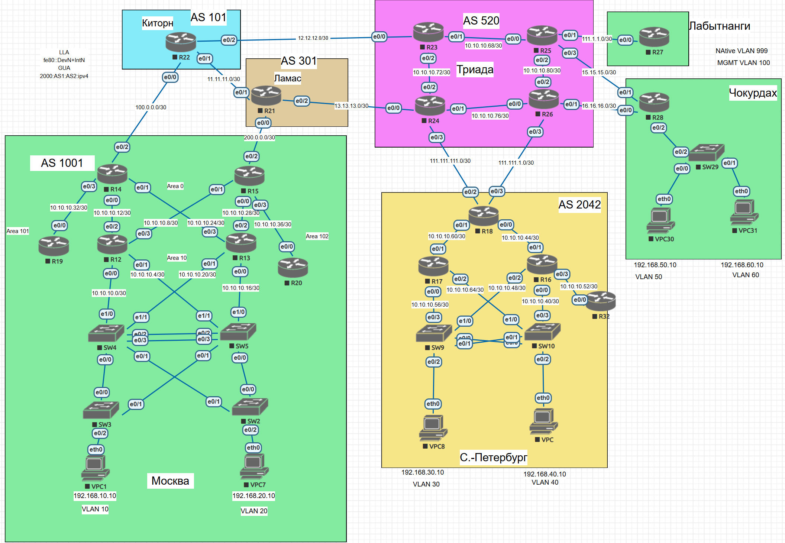

# Основные протоколы сети интернет

## Цель:
Настроить DHCP в офисе Москва   
Настроить синхронизацию времени в офисе Москва      
Настроить NAT в офисе Москва, C.-Перетбруг и Чокурдах       


Описание/Пошаговая инструкция выполнения домашнего задания:


- Настроите NAT(PAT) на R14 и R15. Трансляция должна осуществляться в адрес автономной системы AS1001.
- Настроите NAT(PAT) на R18. Трансляция должна осуществляться в пул из 5 адресов автономной системы AS2042.
- Настроите статический NAT для R20.
- Настроите NAT так, чтобы R19 был доступен с любого узла для удаленного управления.
- *Настроите статический NAT(PAT) для офиса Чокурдах.
- Настроите для IPv4 DHCP сервер в офисе Москва на маршрутизаторах R12 и R13. VPC1 и VPC7 должны получать сетевые настройки по DHCP.
- Настроите NTP сервер на R12 и R13. Все устройства в офисе Москва должны синхронизировать время с R12 и R13.
- Все офисы в лабораторной работе должны иметь IP связность.
- План работы и изменения зафиксированы в документации.


## Топология



## Настроите NAT(PAT) на R14 и R15. Трансляция должна осуществляться в адрес автономной системы AS1001.
R14 и R15
```
access-list 11 permit 1.1.1.0 0.0.0.15
access-list 11 permit 192.168.10.0 0.0.0.255
access-list 11 permit 192.168.20.0 0.0.0.255

ip nat inside source list 11 interface Ethernet0/2 overload

interface Ethernet0/0
  ip nat inside

interface Ethernet0/1
  ip nat inside

interface Ethernet0/2
 ip nat outside

interface Ethernet0/3
 ip nat inside
 
```

Проверка
```
VPCS> ping  192.168.40.10

84 bytes from 192.168.40.10 icmp_seq=1 ttl=56 time=5.093 ms
84 bytes from 192.168.40.10 icmp_seq=2 ttl=56 time=5.186 ms
84 bytes from 192.168.40.10 icmp_seq=3 ttl=56 time=3.975 ms
84 bytes from 192.168.40.10 icmp_seq=4 ttl=56 time=4.195 ms
84 bytes from 192.168.40.10 icmp_seq=5 ttl=56 time=4.708 ms

VPCS> ping  192.168.30.10

84 bytes from 192.168.30.10 icmp_seq=1 ttl=56 time=18.004 ms
84 bytes from 192.168.30.10 icmp_seq=2 ttl=56 time=5.978 ms
84 bytes from 192.168.30.10 icmp_seq=3 ttl=56 time=8.929 ms
84 bytes from 192.168.30.10 icmp_seq=4 ttl=56 time=6.947 ms
84 bytes from 192.168.30.10 icmp_seq=5 ttl=56 time=6.086 ms


R15#sh ip nat trans
Pro Inside global      Inside local       Outside local      Outside global
icmp 200.0.0.2:51719   192.168.10.10:51719 192.168.40.10:51719 192.168.40.10:51719
icmp 200.0.0.2:51975   192.168.10.10:51975 192.168.40.10:51975 192.168.40.10:51975
icmp 200.0.0.2:52231   192.168.10.10:52231 192.168.40.10:52231 192.168.40.10:52231
icmp 200.0.0.2:52487   192.168.10.10:52487 192.168.40.10:52487 192.168.40.10:52487
icmp 200.0.0.2:52743   192.168.10.10:52743 192.168.40.10:52743 192.168.40.10:52743
icmp 200.0.0.2:59143   192.168.10.10:59143 192.168.30.10:59143 192.168.30.10:59143
icmp 200.0.0.2:59399   192.168.10.10:59399 192.168.30.10:59399 192.168.30.10:59399
icmp 200.0.0.2:59655   192.168.10.10:59655 192.168.30.10:59655 192.168.30.10:59655
icmp 200.0.0.2:59911   192.168.10.10:59911 192.168.30.10:59911 192.168.30.10:59911
icmp 200.0.0.2:60167   192.168.10.10:60167 192.168.30.10:60167 192.168.30.10:60167
R15#


```


## Настроите NAT(PAT) на R18. Трансляция должна осуществляться в пул из 5 адресов автономной системы AS2042.
R18
```
R18(config)#interface Ethernet0/0
R18(config-if)#ip nat inside
R18(config-if)#interface Ethernet0/1
R18(config-if)#ip nat inside
R18(config-if)#interface Ethernet0/2
R18(config-if)#ip nat outside
R18(config-if)#interface Ethernet0/3
R18(config-if)#ip nat outside
R18(config-if)#ip nat pool POOLR18 123.0.0.0 123.0.0.0 netmask 255.255.255.0
R18(config)#ip nat inside source list 10 interface Ethernet0/2 overload
R18(config)#ip nat inside source list 11 interface Ethernet0/3 overload

R18(config)#access-list 10 permit host 192.168.30.10
R18(config)#access-list 10 permit host 192.168.40.10
R18(config)#access-list 11 permit host 1.1.1.17
R18(config)#access-list 11 permit host 1.1.1.16
R18(config)#access-list 11 permit host 1.1.1.32


```

## Настроите статический NAT для R20.
R15
```
ip nat inside source static 10.10.10.38 172.16.0.20
```
Проверка
```
R21#ping 172.16.0.20 source 1.1.1.21
Type escape sequence to abort.
Sending 5, 100-byte ICMP Echos to 172.16.0.20, timeout is 2 seconds:
Packet sent with a source address of 1.1.1.21
!!!!!
Success rate is 100 percent (5/5), round-trip min/avg/max = 1/2/3 ms
R21#

R15#sh ip nat translations
Pro Inside global      Inside local       Outside local      Outside global
tcp 200.0.0.2:1        1.1.1.15:179       1.1.1.14:62601     1.1.1.14:62601
icmp 172.16.0.20:1     10.10.10.38:1      1.1.1.21:1         1.1.1.21:1
--- 172.16.0.20        10.10.10.38        ---                ---
R15#

```
## Настроите NAT так, чтобы R19 был доступен с любого узла для удаленного управления.
R19
```
R19(config)#ip domain-name otus.lab
R19(config)#
R19(config)#crypto key generate rsa
The name for the keys will be: R19.otus.lab
Choose the size of the key modulus in the range of 360 to 4096 for your
  General Purpose Keys. Choosing a key modulus greater than 512 may take
  a few minutes.

How many bits in the modulus [512]: 1024
% Generating 1024 bit RSA keys, keys will be non-exportable...
[OK] (elapsed time was 1 seconds)

R19(config)#
R19(config)#line vty 0 4
R19(config-line)#transport input ssh
R19(config-line)#login local
R19(config-line)#username admin secret cisco
R19(config)#ip ssh version 2
R19(config)#enable secret cisco

```
R14
```
ip nat inside source static tcp 1.1.1.19 22 172.16.0.19 22 extendable

```
Проверка

```

R21#ssh -l admin  172.16.0.19
Password:
R19>en
% No password set
R19>exit

[Connection to 172.16.0.19 closed by foreign host]
R21#
```


## Настроите для IPv4 DHCP сервер в офисе Москва на маршрутизаторах R12 и R13. VPC1 и VPC7 должны получать сетевые настройки по DHCP.
R12
```
R12(config)#ip dhcp excluded-address 192.168.10.1
R12(config)#ip dhcp excluded-address 192.168.10.2
R12(config)#ip dhcp excluded-address 192.168.10.3
R12(config)#ip dhcp excluded-address 192.168.20.3
R12(config)#ip dhcp excluded-address 192.168.20.2
R12(config)#ip dhcp excluded-address 192.168.20.1
R12(config)#ip dhcp pool vlan10
R12(dhcp-config)# network 192.168.10.0 255.255.255.0
R12(dhcp-config)# default-router 192.168.10.1
R12(dhcp-config)#ip dhcp pool vlan20
R12(dhcp-config)# network 192.168.20.0 255.255.255.0
R12(dhcp-config)# default-router 192.168.20.1
R12(dhcp-config)#

```

R13
```
R13(config)#ip dhcp excluded-address 192.168.10.1
R13(config)#ip dhcp excluded-address 192.168.10.2
R13(config)#ip dhcp excluded-address 192.168.10.3
R13(config)#ip dhcp excluded-address 192.168.20.3
R13(config)#ip dhcp excluded-address 192.168.20.2
R13(config)#ip dhcp excluded-address 192.168.20.1
R13(config)#ip dhcp pool vlan10
R13(dhcp-config)# network 192.168.10.0 255.255.255.0
R13(dhcp-config)# default-router 192.168.10.1
R13(dhcp-config)#ip dhcp pool vlan20
R13(dhcp-config)# network 192.168.20.0 255.255.255.0
R13(dhcp-config)# default-router 192.168.20.1
R13(dhcp-config)#

```
На SW4 и SW5
```
interface Vlan10
 ip helper-address 1.1.1.13
 ip helper-address 1.1.1.12
 interface Vlan20
 ip helper-address 1.1.1.13
 ip helper-address 1.1.1.12

```
Проверка
```

VPCS> dhcp -r
DDORA IP 192.168.20.4/24 GW 192.168.20.1

VPCS>
```


## Настроите NTP сервер на R12 и R13. Все устройства в офисе Москва должны синхронизировать время с R12 и R13.
R12 и R13
```
ntp source Loopback0
ntp master 5
ntp update-calendar
```
На остальных устройствах

```
ntp server 1.1.1.12
ntp server 1.1.1.13
```

Проверка
```
SW5#sh ntp associations

  address         ref clock       st   when   poll reach  delay  offset   disp
*~1.1.1.12        127.127.1.1      5     14     64     1  1.000   0.500 189.44
+~1.1.1.13        127.127.1.1      5     14     64     1  1.000  -0.500 189.44
 * sys.peer, # selected, + candidate, - outlyer, x falseticker, ~ configured
SW5#


```
