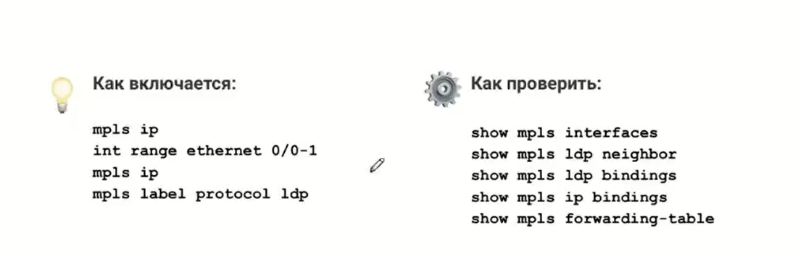

# Базовый сервис MPLS

## Цель:
Настроить BGP free core в офисах Москвы и Санкт-Петербурга.


## Описание/Пошаговая инструкция выполнения домашнего задания:
В этой самостоятельной работе мы ожидаем, что вы:

- Настроите BGP free core в офисе Москвы.
- Настроите BGP free core в офисе Санкт-Петербурга.


## Топология


## Настроите BGP free core в офисе Москвы.

Чтобы запустить BGP Free Core необходимо запустить MPLS и LDP на интерфейсах в сторону нашей сети на всех устройствах в AS. iBGP сессии оставить только между бордерами.
Действовать будем согласно плану из урока:

На R14 и R15 включим на интерфейсах E0/0-1, E0/3, А на R12-13 на интерфейсах E0/2-3

Включаем:

```
R14(config)#mpls ip
R14(config)#int ra e0/0-1, e0/3
R14(config-if-range)#mpls ip
R14(config-if-range)#mpls label protocol ldp
```

</code></pre>
</details>
<details>
<summary>R12 Проверка </summary>
<pre><code>

```
R12#sh mpls int det
Interface Ethernet0/0:
        Type Unknown
        IP labeling enabled (ldp):
          Interface config
        LSP Tunnel labeling not enabled
        IP FRR labeling not enabled
        BGP labeling not enabled
        MPLS operational
        MTU = 1500
Interface Ethernet0/1:
        Type Unknown
        IP labeling enabled (ldp):
          Interface config
        LSP Tunnel labeling not enabled
        IP FRR labeling not enabled
        BGP labeling not enabled
        MPLS operational
        MTU = 1500
Interface Ethernet0/2:
        Type Unknown
        IP labeling enabled (ldp):
          Interface config
        LSP Tunnel labeling not enabled
        IP FRR labeling not enabled
        BGP labeling not enabled
        MPLS operational
        MTU = 1500
Interface Ethernet0/3:
        Type Unknown
        IP labeling enabled (ldp):
          Interface config
        LSP Tunnel labeling not enabled
        IP FRR labeling not enabled
        BGP labeling not enabled
        MPLS operational
        MTU = 1500
R12#
R12#sh mpls ldp nei
R12#sh mpls ldp neighbor
    Peer LDP Ident: 1.1.1.4:0; Local LDP Ident 1.1.1.12:0
        TCP connection: 1.1.1.4.646 - 1.1.1.12.50093
        State: Oper; Msgs sent/rcvd: 21/21; Downstream
        Up time: 00:00:45
        LDP discovery sources:
          Ethernet0/0, Src IP addr: 10.10.10.2
        Addresses bound to peer LDP Ident:
          10.10.10.2      10.10.10.22     1.1.1.4         192.168.10.2
          192.168.20.2    192.168.20.1    192.168.10.1
    Peer LDP Ident: 1.1.1.5:0; Local LDP Ident 1.1.1.12:0
        TCP connection: 1.1.1.5.646 - 1.1.1.12.31190
        State: Oper; Msgs sent/rcvd: 21/21; Downstream
        Up time: 00:00:44
        LDP discovery sources:
          Ethernet0/1, Src IP addr: 10.10.10.6
        Addresses bound to peer LDP Ident:
          10.10.10.18     10.10.10.6      1.1.1.5         192.168.10.3
          192.168.20.3
        Duplicate Addresses advertised by peer:
          192.168.10.1    192.168.20.1
    Peer LDP Ident: 200.20.20.14:0; Local LDP Ident 1.1.1.12:0
        TCP connection: 200.20.20.14.60721 - 1.1.1.12.646
        State: Oper; Msgs sent/rcvd: 21/23; Downstream
        Up time: 00:00:44
        LDP discovery sources:
          Ethernet0/2, Src IP addr: 10.10.10.10
        Addresses bound to peer LDP Ident:
          10.10.10.10     10.10.10.30     100.0.0.2       10.10.10.33
          1.1.1.14        200.20.20.14    200.20.20.19
R12#
R12#sh mpls ldp bind
  lib entry: 0.0.0.0/0, rev 36
        local binding:  label: imp-null
        remote binding: lsr: 1.1.1.4:0, label: imp-null
        remote binding: lsr: 1.1.1.5:0, label: imp-null
  lib entry: 1.1.1.4/32, rev 2
        local binding:  label: 16
        remote binding: lsr: 1.1.1.4:0, label: imp-null
        remote binding: lsr: 1.1.1.5:0, label: 16
        remote binding: lsr: 200.20.20.14:0, label: 16
  lib entry: 1.1.1.5/32, rev 4
        local binding:  label: 17
        remote binding: lsr: 1.1.1.4:0, label: 16
        remote binding: lsr: 1.1.1.5:0, label: imp-null
        remote binding: lsr: 200.20.20.14:0, label: 17
  lib entry: 1.1.1.12/32, rev 6
        local binding:  label: imp-null
        remote binding: lsr: 1.1.1.4:0, label: 17
        remote binding: lsr: 1.1.1.5:0, label: 17
        remote binding: lsr: 200.20.20.14:0, label: 18
  lib entry: 1.1.1.13/32, rev 8
        local binding:  label: 18
        remote binding: lsr: 1.1.1.4:0, label: 18
        remote binding: lsr: 1.1.1.5:0, label: 18
        remote binding: lsr: 200.20.20.14:0, label: 19
  lib entry: 1.1.1.14/32, rev 30
        local binding:  label: 25
        remote binding: lsr: 1.1.1.4:0, label: 25
        remote binding: lsr: 1.1.1.5:0, label: 25
        remote binding: lsr: 200.20.20.14:0, label: imp-null
  lib entry: 1.1.1.19/32, rev 34
        local binding:  label: 27
        remote binding: lsr: 1.1.1.4:0, label: 27
        remote binding: lsr: 1.1.1.5:0, label: 27
        remote binding: lsr: 200.20.20.14:0, label: 20
  lib entry: 10.10.10.0/30, rev 10
        local binding:  label: imp-null
        remote binding: lsr: 1.1.1.4:0, label: imp-null
        remote binding: lsr: 1.1.1.5:0, label: 19
        remote binding: lsr: 200.20.20.14:0, label: 21
  lib entry: 10.10.10.4/30, rev 12
        local binding:  label: imp-null
        remote binding: lsr: 1.1.1.4:0, label: 19
        remote binding: lsr: 1.1.1.5:0, label: imp-null
        remote binding: lsr: 200.20.20.14:0, label: 22
  lib entry: 10.10.10.8/30, rev 14
        local binding:  label: imp-null
        remote binding: lsr: 1.1.1.4:0, label: 20
        remote binding: lsr: 1.1.1.5:0, label: 20
        remote binding: lsr: 200.20.20.14:0, label: imp-null
  lib entry: 10.10.10.12/30, rev 16
        local binding:  label: imp-null
        remote binding: lsr: 1.1.1.4:0, label: 21
        remote binding: lsr: 1.1.1.5:0, label: 21
        remote binding: lsr: 200.20.20.14:0, label: 23
  lib entry: 10.10.10.16/30, rev 18
        local binding:  label: 19
        remote binding: lsr: 1.1.1.4:0, label: 22
        remote binding: lsr: 1.1.1.5:0, label: imp-null
        remote binding: lsr: 200.20.20.14:0, label: 24
  lib entry: 10.10.10.20/30, rev 20
        local binding:  label: 20
        remote binding: lsr: 1.1.1.4:0, label: imp-null
        remote binding: lsr: 1.1.1.5:0, label: 22
        remote binding: lsr: 200.20.20.14:0, label: 25
  lib entry: 10.10.10.24/30, rev 22
        local binding:  label: 21
        remote binding: lsr: 1.1.1.4:0, label: 23
        remote binding: lsr: 1.1.1.5:0, label: 23
        remote binding: lsr: 200.20.20.14:0, label: 26
  lib entry: 10.10.10.28/30, rev 24
        local binding:  label: 22
        remote binding: lsr: 1.1.1.4:0, label: 24
        remote binding: lsr: 1.1.1.5:0, label: 24
        remote binding: lsr: 200.20.20.14:0, label: imp-null
  lib entry: 10.10.10.32/30, rev 32
        local binding:  label: 26
        remote binding: lsr: 1.1.1.4:0, label: 26
        remote binding: lsr: 1.1.1.5:0, label: 26
        remote binding: lsr: 200.20.20.14:0, label: imp-null
  lib entry: 100.0.0.0/30, rev 40
        remote binding: lsr: 200.20.20.14:0, label: imp-null
  lib entry: 172.16.0.14/32, rev 41
        remote binding: lsr: 200.20.20.14:0, label: imp-null
  lib entry: 192.168.10.0/24, rev 26
        local binding:  label: 23
        remote binding: lsr: 1.1.1.4:0, label: imp-null
        remote binding: lsr: 1.1.1.5:0, label: imp-null
        remote binding: lsr: 200.20.20.14:0, label: 27
  lib entry: 192.168.20.0/24, rev 28
        local binding:  label: 24
        remote binding: lsr: 1.1.1.4:0, label: imp-null
        remote binding: lsr: 1.1.1.5:0, label: imp-null
        remote binding: lsr: 200.20.20.14:0, label: 28
  lib entry: 200.20.20.0/22, rev 42
        remote binding: lsr: 200.20.20.14:0, label: imp-null
R12#
R12#
R12#sh mpls fo
R12#sh mpls forwarding-table
Local      Outgoing   Prefix           Bytes Label   Outgoing   Next Hop
Label      Label      or Tunnel Id     Switched      interface
16         Pop Label  1.1.1.4/32       0             Et0/0      10.10.10.2
17         Pop Label  1.1.1.5/32       0             Et0/1      10.10.10.6
18         18         1.1.1.13/32      0             Et0/0      10.10.10.2
           18         1.1.1.13/32      0             Et0/1      10.10.10.6
19         Pop Label  10.10.10.16/30   0             Et0/1      10.10.10.6
20         Pop Label  10.10.10.20/30   0             Et0/0      10.10.10.2
21         26         10.10.10.24/30   0             Et0/2      10.10.10.10
22         Pop Label  10.10.10.28/30   0             Et0/2      10.10.10.10
23         Pop Label  192.168.10.0/24  0             Et0/0      10.10.10.2
           Pop Label  192.168.10.0/24  0             Et0/1      10.10.10.6
24         Pop Label  192.168.20.0/24  0             Et0/0      10.10.10.2
           Pop Label  192.168.20.0/24  0             Et0/1      10.10.10.6
25         Pop Label  1.1.1.14/32      0             Et0/2      10.10.10.10
26         Pop Label  10.10.10.32/30   0             Et0/2      10.10.10.10
27         20         1.1.1.19/32      0             Et0/2      10.10.10.10
R12#

```

</code></pre>
</details>


## Настроите BGP free core в офисе Санкт-Петербурга.
</code></pre>
</details>
<details>
<summary>Пример R18</summary>
<pre><code>

```
R18#sh mpls int det
Interface Ethernet0/0:
        Type Unknown
        IP labeling enabled (ldp):
          Interface config
        LSP Tunnel labeling not enabled
        IP FRR labeling not enabled
        BGP labeling not enabled
        MPLS operational
        MTU = 1500
Interface Ethernet0/1:
        Type Unknown
        IP labeling enabled (ldp):
          Interface config
        LSP Tunnel labeling not enabled
        IP FRR labeling not enabled
        BGP labeling not enabled
        MPLS operational
        MTU = 1500
R18#sh mpls nei
R18#sh mpls ldp nei
R18#sh mpls ldp neighbor
    Peer LDP Ident: 1.1.1.17:0; Local LDP Ident 1.1.1.18:0
        TCP connection: 1.1.1.17.646 - 1.1.1.18.45714
        State: Oper; Msgs sent/rcvd: 32/34; Downstream
        Up time: 00:12:44
        LDP discovery sources:
          Ethernet0/1, Src IP addr: 10.10.10.61
        Addresses bound to peer LDP Ident:
          10.10.10.57     10.10.10.61     10.10.10.65     1.1.1.17
    Peer LDP Ident: 1.1.1.16:0; Local LDP Ident 1.1.1.18:0
        TCP connection: 1.1.1.16.646 - 1.1.1.18.22777
        State: Oper; Msgs sent/rcvd: 31/33; Downstream
        Up time: 00:12:02
        LDP discovery sources:
          Ethernet0/0, Src IP addr: 10.10.10.45
        Addresses bound to peer LDP Ident:
          10.10.10.41     10.10.10.45     10.10.10.49     10.10.10.53
          1.1.1.16
R18#sh mpls ldp binfd
R18#sh mpls ldp bind
R18#sh mpls ldp bindings
  lib entry: 0.0.0.0/0, rev 2
        local binding:  label: imp-null
        remote binding: lsr: 1.1.1.17:0, label: imp-null
        remote binding: lsr: 1.1.1.16:0, label: imp-null
  lib entry: 1.1.1.9/32, rev 4
        local binding:  label: 16
        remote binding: lsr: 1.1.1.17:0, label: 16
        remote binding: lsr: 1.1.1.16:0, label: 16
  lib entry: 1.1.1.10/32, rev 6
        local binding:  label: 17
        remote binding: lsr: 1.1.1.17:0, label: 17
        remote binding: lsr: 1.1.1.16:0, label: 17
  lib entry: 1.1.1.16/32, rev 8
        local binding:  label: 18
        remote binding: lsr: 1.1.1.17:0, label: 18
        remote binding: lsr: 1.1.1.16:0, label: imp-null
  lib entry: 1.1.1.17/32, rev 10
        local binding:  label: 19
        remote binding: lsr: 1.1.1.17:0, label: imp-null
        remote binding: lsr: 1.1.1.16:0, label: 18
  lib entry: 1.1.1.18/32, rev 12
        local binding:  label: imp-null
        remote binding: lsr: 1.1.1.17:0, label: 19
        remote binding: lsr: 1.1.1.16:0, label: 19
  lib entry: 1.1.1.32/32, rev 14
        local binding:  label: 20
        remote binding: lsr: 1.1.1.17:0, label: 20
        remote binding: lsr: 1.1.1.16:0, label: 20
  lib entry: 10.10.10.32/27, rev 16
        local binding:  label: 21
        remote binding: lsr: 1.1.1.17:0, label: imp-null
        remote binding: lsr: 1.1.1.16:0, label: imp-null
  lib entry: 10.10.10.40/30, rev 31
        remote binding: lsr: 1.1.1.17:0, label: 21
        remote binding: lsr: 1.1.1.16:0, label: imp-null
  lib entry: 10.10.10.44/30, rev 18
        local binding:  label: imp-null
        remote binding: lsr: 1.1.1.17:0, label: 22
        remote binding: lsr: 1.1.1.16:0, label: imp-null
  lib entry: 10.10.10.48/30, rev 32
        remote binding: lsr: 1.1.1.17:0, label: 23
        remote binding: lsr: 1.1.1.16:0, label: imp-null
  lib entry: 10.10.10.52/30, rev 33
        remote binding: lsr: 1.1.1.17:0, label: 24
        remote binding: lsr: 1.1.1.16:0, label: imp-null
  lib entry: 10.10.10.56/30, rev 34
        remote binding: lsr: 1.1.1.17:0, label: imp-null
        remote binding: lsr: 1.1.1.16:0, label: 21
  lib entry: 10.10.10.60/30, rev 20
        local binding:  label: imp-null
        remote binding: lsr: 1.1.1.17:0, label: imp-null
        remote binding: lsr: 1.1.1.16:0, label: 22
  lib entry: 10.10.10.64/30, rev 22
        local binding:  label: 22
        remote binding: lsr: 1.1.1.17:0, label: imp-null
        remote binding: lsr: 1.1.1.16:0, label: 23
  lib entry: 10.15.18.0/30, rev 24
        local binding:  label: imp-null
  lib entry: 111.111.111.0/30, rev 26
        local binding:  label: imp-null
  lib entry: 192.168.30.0/24, rev 28
        local binding:  label: 23
        remote binding: lsr: 1.1.1.17:0, label: 25
        remote binding: lsr: 1.1.1.16:0, label: 24
  lib entry: 192.168.40.0/24, rev 30
        local binding:  label: 24
        remote binding: lsr: 1.1.1.17:0, label: 26
        remote binding: lsr: 1.1.1.16:0, label: 25
R18#
R18#
R18#sh mpls ip bin
R18#sh mpls ip binding
  0.0.0.0/0
        in label:     imp-null
        out label:    imp-null  lsr: 1.1.1.17:0
        out label:    imp-null  lsr: 1.1.1.16:0
  1.1.1.9/32
        in label:     16
        out label:    16        lsr: 1.1.1.17:0       inuse
        out label:    16        lsr: 1.1.1.16:0       inuse
  1.1.1.10/32
        in label:     17
        out label:    17        lsr: 1.1.1.17:0       inuse
        out label:    17        lsr: 1.1.1.16:0       inuse
  1.1.1.16/32
        in label:     18
        out label:    18        lsr: 1.1.1.17:0
        out label:    imp-null  lsr: 1.1.1.16:0       inuse
  1.1.1.17/32
        in label:     19
        out label:    imp-null  lsr: 1.1.1.17:0       inuse
        out label:    18        lsr: 1.1.1.16:0
  1.1.1.18/32
        in label:     imp-null
        out label:    19        lsr: 1.1.1.17:0
        out label:    19        lsr: 1.1.1.16:0
  1.1.1.32/32
        in label:     20
        out label:    20        lsr: 1.1.1.17:0
        out label:    20        lsr: 1.1.1.16:0       inuse
  10.10.10.32/27
        in label:     21
        out label:    imp-null  lsr: 1.1.1.17:0       inuse
        out label:    imp-null  lsr: 1.1.1.16:0       inuse
  10.10.10.40/30
        out label:    21        lsr: 1.1.1.17:0
        out label:    imp-null  lsr: 1.1.1.16:0
  10.10.10.44/30
        in label:     imp-null
        out label:    22        lsr: 1.1.1.17:0
        out label:    imp-null  lsr: 1.1.1.16:0
  10.10.10.48/30
        out label:    23        lsr: 1.1.1.17:0
        out label:    imp-null  lsr: 1.1.1.16:0
  10.10.10.52/30
        out label:    24        lsr: 1.1.1.17:0
        out label:    imp-null  lsr: 1.1.1.16:0
  10.10.10.56/30
        out label:    imp-null  lsr: 1.1.1.17:0
        out label:    21        lsr: 1.1.1.16:0
  10.10.10.60/30
        in label:     imp-null
        out label:    imp-null  lsr: 1.1.1.17:0
        out label:    22        lsr: 1.1.1.16:0
  10.10.10.64/30
        in label:     22
        out label:    imp-null  lsr: 1.1.1.17:0       inuse
        out label:    23        lsr: 1.1.1.16:0
  10.15.18.0/30
        in label:     imp-null
  111.111.111.0/30
        in label:     imp-null
  192.168.30.0/24
        in label:     23
        out label:    25        lsr: 1.1.1.17:0       inuse
        out label:    24        lsr: 1.1.1.16:0       inuse
  192.168.40.0/24
        in label:     24
        out label:    26        lsr: 1.1.1.17:0       inuse
        out label:    25        lsr: 1.1.1.16:0       inuse
R18#
R18#
R18#
R18#
R18#sh mpls fo
R18#sh mpls forwarding-table
Local      Outgoing   Prefix           Bytes Label   Outgoing   Next Hop
Label      Label      or Tunnel Id     Switched      interface
16         16         1.1.1.9/32       0             Et0/0      10.10.10.45
           16         1.1.1.9/32       0             Et0/1      10.10.10.61
17         17         1.1.1.10/32      0             Et0/0      10.10.10.45
           17         1.1.1.10/32      0             Et0/1      10.10.10.61
18         Pop Label  1.1.1.16/32      0             Et0/0      10.10.10.45
19         Pop Label  1.1.1.17/32      0             Et0/1      10.10.10.61
20         20         1.1.1.32/32      0             Et0/0      10.10.10.45
21         Pop Label  10.10.10.32/27   0             Et0/0      10.10.10.45
           Pop Label  10.10.10.32/27   0             Et0/1      10.10.10.61
22         Pop Label  10.10.10.64/30   0             Et0/1      10.10.10.61
23         24         192.168.30.0/24  0             Et0/0      10.10.10.45
           25         192.168.30.0/24  0             Et0/1      10.10.10.61
24         25         192.168.40.0/24  0             Et0/0      10.10.10.45
           26         192.168.40.0/24  0             Et0/1      10.10.10.61
R18#

```
</code></pre>
</details>
